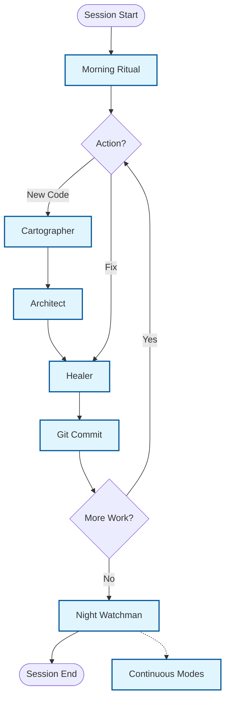

# The Daily Workflow (The "Engine")

**Version:** 1.0.0 (Protocol)
**Status:** Production-Ready
**Purpose:** A comprehensive, mode-based workflow that integrates AI-driven QA automation with proper Git hygiene and documentation.

---

## Overview

This workflow follows a 7-phase cycle that structures every work session. Each phase has detailed documentation in dedicated files.

## The 7-Phase Cycle

---

## Phase Documentation

| Phase | File | Purpose |
|-------|------|---------|
| **Overview** | [00_overview.md](./workflow/00_overview.md) | Complete workflow overview and diagram |
| **Phase 1** | [01_morning_ritual.md](./workflow/01_morning_ritual.md) | Session startup and health checks |
| **Phase 2** | [02_cartographer.md](./workflow/02_cartographer.md) | Discovery and selector mapping |
| **Phase 3** | [03_architect.md](./workflow/03_architect.md) | Implementation and Page Objects |
| **Phase 4** | [04_healer.md](./workflow/04_healer.md) | Maintenance and fixes |
| **Phase 5** | [05_git_commit.md](./workflow/05_git_commit.md) | Universal commit flow |
| **Phase 6** | [06_night_watchman.md](./workflow/06_night_watchman.md) | Session shutdown and logging |
| **Phase 7** | [07_continuous_modes.md](./workflow/07_continuous_modes.md) | Smoke Test and Archaeology |
| **Reference** | [08_quick_reference.md](./workflow/08_quick_reference.md) | Quick lookup and best practices |

---

## Quick Start

### Starting a Session

1. Activate **Morning Ritual Mode**
2. Run environment health check
3. Review active sprint
4. Choose next mode based on work needed

### During Work

1. **New page?** Cartographer Mode first, then Architect Mode
2. **Test failing?** Healer Mode
3. **After each mode:** Git Commit Flow

### Ending a Session

1. Activate **Night Watchman Mode**
2. Create daily log
3. Clean active sprint
4. Commit and push

---

## Key Principle

> Each phase has clear entry criteria, tasks, and exit criteria. Never skip phases.

---

## Related Documentation

- [mission.md](./mission.md) - Core principles
- [git_standards.md](./git_standards.md) - Commit message format
- [decision_log.md](./decision_log.md) - Architectural decisions
- [selector_vault.md](../3_MEMORY/selector_vault.md) - Verified selectors
- [failure_patterns.md](../3_MEMORY/failure_patterns.md) - Known issues
