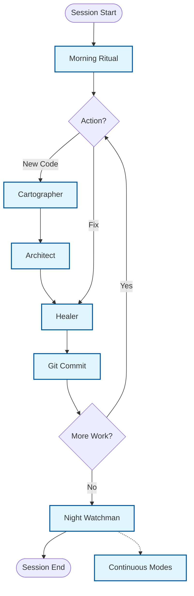

# The Daily Workflow - Overview

**Version:** 1.0.0 (Protocol)
**Status:** Production-Ready
**Purpose:** A comprehensive, mode-based workflow that integrates AI-driven QA automation with proper Git hygiene and documentation.

---

## The 7-Phase Cycle

Every work session follows this cycle:

1. Morning Ritual (Startup)
2. Cartographer Mode (Discovery)
3. Architect Mode (Implementation)
4. Healer Mode (Fixes)
5. Git Commit Flow (Documentation)
6. Night Watchman Mode (Shutdown)
7. Continuous Modes (On Demand)

---

## Key Principles

1. **Each phase has clear entry criteria, tasks, and exit criteria.** Never skip phases.
2. **The protocol is client-agnostic.** Whether you use Cursor, Claude Desktop, or a CLI agent, the 7-phase cycle remains the same as long as the MCP server is active.
3. **Always commit after each mode completes.**
4. **Always document decisions and failures.**

---

## Phase Quick Links

| Phase | File | Purpose |
|-------|------|---------|
| 1 | [Morning Ritual](./01_morning_ritual.md) | Session Startup |
| 2 | [Cartographer](./02_cartographer.md) | Discovery and Mapping |
| 3 | [Architect](./03_architect.md) | Implementation |
| 4 | [Healer](./04_healer.md) | Maintenance and Fixes |
| 5 | [Git Commit](./05_git_commit.md) | Universal Commit Flow |
| 6 | [Night Watchman](./06_night_watchman.md) | Session Shutdown |
| 7 | [Continuous Modes](./07_continuous_modes.md) | On-Demand Modes |
| - | [Quick Reference](./08_quick_reference.md) | Cheatsheet and Best Practices |
| - | [Prompts](../prompts/README.md) | Copy-Paste Prompt Templates |

---

## Related Files

- [mission.md](../mission.md) - Core principles
- [git_standards.md](../git_standards.md) - Commit message format
- [decision_log.md](../decision_log.md) - Architectural decisions
- [selector_vault.md](../../3_MEMORY/selector_vault.md) - Verified selectors
- [failure_patterns.md](../../3_MEMORY/failure_patterns.md) - Known issues
