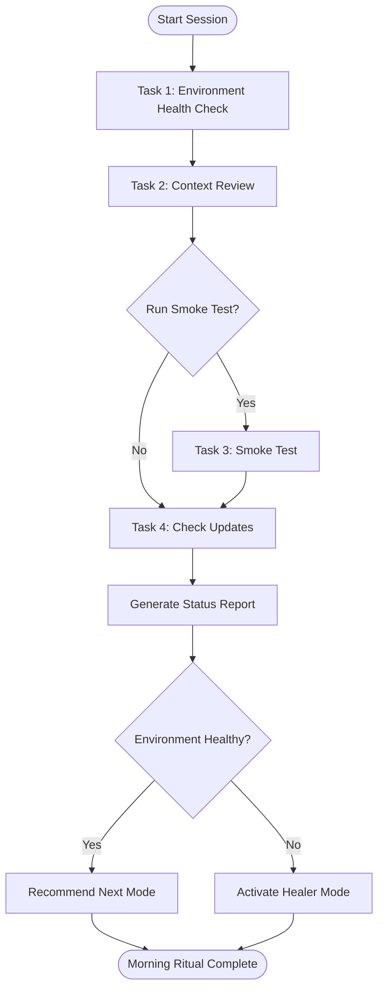

# Phase 1: Morning Ritual (Session Startup)

**When to Use:** Start of every work session

**Duration:** 2-5 minutes

**Philosophy:** "Context loading before code writing."

**Quick Copy:** [Prompt Template](../prompts/01_morning_ritual.md)

---

## Workflow Diagram



---

## Prompt Template

```
Activate **Morning Ritual Mode**.

**Tasks:**
1. Run environment health check:
   - Execute `npm test` to verify baseline
   - Execute `npm run lint` to check code quality
   - Check git status: `git status`
   
2. Review context:
   - Read `.ai/2_PLANNING/active_sprint.md`
   - Check "Last Completed Task" and "Next Session Focus"
   - Review any blockers
   
3. Activate Smoke Test (optional but recommended):
   - Read `.ai/3_MEMORY/selector_vault.md`
   - Pick 3-5 random selectors from different pages
   - Use MCP to verify they still work
   - Report health status
   
4. Check for updates:
   - Any new daily logs since last session?
   - Any new decisions in decision_log.md?
   - Any new failure patterns?

**Exit Criteria:**
- [ ] Environment is healthy (tests passing, no lint errors, TypeScript clean)
- [ ] Context loaded (know what to work on)
- [ ] No critical selectors broken (smoke test passed)
- [ ] Ready to choose next mode

**Deliverable:** Status report + recommendation for which mode to activate next
```

---

## Detailed Task Breakdown

### Task 1: Environment Health Check

Verify the development environment is healthy before starting work.

**Commands:**

- `npm test` - Run the test suite
- `npm run lint` - Check code quality standards
- `npm run lint:fix` - Auto-fix style issues
- `npm run type-check` - Verify TypeScript compilation
- `git status` - Ensure working directory state is understood

**Expected Results:**

| Check | Pass Criteria |
|-------|---------------|
| Tests | All passing (green) |
| Lint | 0 errors |
| TypeScript | No compilation errors |
| Git | Clean working directory or known changes |

---

### Task 2: Context Review

Read key files to understand current state and priorities.

**Files to Read:**

- `.ai/2_PLANNING/active_sprint.md` - Current sprint state and pending tasks
- `.ai/1_CONTEXT/decision_log.md` - Recent architectural decisions
- `.ai/3_MEMORY/failure_patterns.md` - Known issues and fixes

**What to Look For:**

- **Last Completed Task:** What was done in the previous session?
- **Next Session Focus:** What is the priority for right now?
- **Blockers:** Are there any issues preventing progress?

---

### Task 3: Smoke Test (Optional)

Quick verification that existing selectors still work.

**When to Run:**

- Start of day
- After deployments
- Weekly health checks
- After a long break from the project

**Procedure:**

1. Open `.ai/3_MEMORY/selector_vault.md`
2. Select 3-5 critical selectors across different pages.
3. For each:
   - Navigate to the page using MCP.
   - Use `highlight_element` to verify it works.
   - Record result as `[PASS]` or `[FAIL]`.

---

### Task 4: Check for Updates

Review what changed since your last session.

**Commands:**

- `git log --oneline -5` - Review recent commit history
- `ls -lt .ai/2_PLANNING/daily_logs/ | head -5` - Check for recent logs
- `git diff HEAD~1 .ai/3_MEMORY/failure_patterns.md` - Check for new patterns
- `git diff HEAD~1 .ai/1_CONTEXT/decision_log.md` - Check for new architectural decisions

**Questions to Answer:**

- Any new daily logs or failure patterns documented?
- Any new architectural decisions made?
- Any urgent blockers noted?

---

## Expected Output

After completing all tasks, generate a status report:

```
Morning Ritual Complete

Environment Health:
- Tests: 3/3 passing [PASS]
- Lint: 0 errors [PASS]
- TypeScript: clean [PASS]
- Git: Clean working directory [PASS]

Context Review:
- Last session: Completed login page automation
- Next focus: Products page mapping
- Blockers: None

Smoke Test:
- Tested 5 selectors across 2 pages
- Results: 5/5 working [PASS]

Recommendation: Activate Cartographer Mode for products page
Target: https://www.saucedemo.com/inventory.html
```

---

## Exit Criteria Checklist

Before proceeding to the next mode, verify:

- [ ] `npm test` - All tests passing
- [ ] `npm run lint` - 0 errors
- [ ] `npm run type-check` - No TypeScript errors
- [ ] `git status` - Clean or changes understood
- [ ] `active_sprint.md` - Read and understood
- [ ] Next action - Clear on what to do next
- [ ] Smoke test - Critical selectors verified (if run)

---

## Troubleshooting

### Tests Failing

**Symptom:** `npm test` shows red/failing tests.

**Action:** Activate [Healer Mode](./04_healer.md) immediately before any other work.

---

### Lint Errors

**Symptom:** `npm run lint` shows errors.

**Action:**

1. Run `npm run lint:fix` to auto-fix.
2. Manually fix remaining errors.
3. Re-run `npm run lint` to confirm clean status.

---

### TypeScript Errors

**Symptom:** `npm run type-check` shows compilation errors.

**Action:**

1. Review error messages and fix type issues.
2. Re-run `npm run type-check`.

---

### Unknown Changes in Git

**Symptom:** `git status` shows unexpected changes.

**Action:**

1. Run `git diff` to review changes.
2. Decide to commit, stash, or reset based on context.
3. Document significant decisions in `active_sprint.md`.

---

### Critical Selector Broken

**Symptom:** Smoke test shows selector failures

**Action:** Flag for [Healer Mode](./04_healer.md), do not proceed with new features.

---

## Next Steps

Choose the next mode based on the ritual results:

| Situation | Next Mode |
|-----------|-----------|
| New page to automate | [Cartographer](./02_cartographer.md) |
| Test failing | [Healer](./04_healer.md) |
| Continue implementation | [Architect](./03_architect.md) |
| Code cleanup needed | [Architect](./03_architect.md) (refactor) |
| Session ending | [Night Watchman](./06_night_watchman.md) |

---

## Related Documentation

- [Morning Ritual Prompt](../prompts/01_morning_ritual.md) - Copy-paste version
- [Active Sprint](../../2_PLANNING/active_sprint.md) - Current sprint state
- [Selector Vault](../../3_MEMORY/selector_vault.md) - Verified selectors

---

**Morning Ritual is complete. Ready for next mode.**
