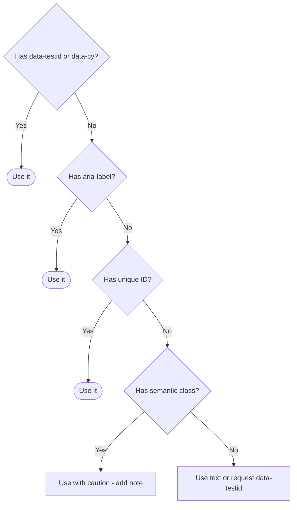

# Phase 2: Cartographer Mode (Discovery)

**When to Use:**

- Starting a new page/feature
- Investigating existing page changes
- Selector validation/audit

**Duration:** 10-20 minutes per page

**Philosophy:** "Map before you build. No code without verified selectors."

**Quick Copy:** [Prompt Template](../prompts/02_cartographer.md)

---

## Workflow Diagram


---

## Prompt Template

```
Activate **Cartographer Mode**.

**Context:**

- Read `.ai/2_PLANNING/active_sprint.md`
- Read `.ai/1_CONTEXT/mission.md`

**Target:** [YOUR_TARGET_URL_HERE]

**Goal:** [WHAT_ELEMENTS_TO_MAP - e.g., "Map login form" or "Map product grid"]

**Tools Required:**

- MCP server (playwright-mcp)

**Task Checklist:**

1. Navigate to target URL using MCP
2. Identify ALL interactive elements for the goal
3. For EACH element, verify selector with MCP hover/highlight
4. Document any edge cases (waits, iframes, dynamic content)
5. Take full-page screenshot
6. Add verified selectors to selector_vault.md
7. Update active_sprint.md with completed task

**Exit Criteria:**

- [ ] All target elements verified via MCP (zero phantom selectors)
- [ ] Selector vault updated with all mapped elements
- [ ] Screenshot saved to maps/ folder
- [ ] Edge cases documented with notes
- [ ] No code written (discovery only)
- [ ] Active sprint updated

**Deliverable:**

- Populated selector vault entries
- Screenshot in maps/ folder
- Updated active sprint
```

---

## Detailed Task Breakdown

### Step 1: Navigate to Target URL

Open the browser and navigate to the target page using MCP.

**MCP Command:**

```
playwright_navigate
  url: "https://www.saucedemo.com/inventory.html"
```

**Verification:**

- [ ] Page loads completely
- [ ] No console errors visible
- [ ] All images and assets loaded
- [ ] Page is interactive

---

### Step 2: Identify Target Elements

Survey the page and list all interactive elements that need selectors.

**Element Types to Look For:**

| Type | Examples | Priority |
|------|----------|----------|
| Inputs | Text fields, password fields, textareas | High |
| Buttons | Submit, cancel, action buttons | High |
| Messages | Error containers, success notifications | High |
| Dropdowns | Select elements, custom dropdowns | Medium |
| Links | Navigation, external links | Medium |
| Lists | Product grids, item lists | Medium |
| Modals | Popups, dialogs | Medium |
| Navigation | Menus, breadcrumbs, tabs | Low |

**Questions to Answer:**

- What is the primary user action on this page?
- What elements are required for that action?
- What validation/feedback elements exist?
- Are there any conditional elements?

---

### Step 3: Verify Each Selector with MCP

For EACH identified element, verify the selector works.

**MCP Command:**

```
playwright_hover
  selector: "#user-name"
```

If the element is highlighted/hovered, the selector is valid.

**Selector Strategy Priority:**

| Priority | Strategy | Example | Reliability |
|----------|----------|---------|-------------|
| 1 | data-testid | `[data-testid="submit"]` | Best |
| 2 | data-cy | `[data-cy="login-btn"]` | Best |
| 3 | aria-label | `[aria-label="Close"]` | Good |
| 4 | id | `#username` | Good |
| 5 | semantic class | `.submit-button` | Caution |
| 6 | text content | `text="Login"` | Caution |
| 7 | xpath | `//button[@type="submit"]` | Avoid |

**Selector Decision Tree:**



---

### Step 4: Document Edge Cases

Note any special handling requirements for elements.

**Edge Cases to Look For:**

| Case | Example | Vault Note |
|------|---------|------------|
| Async loading | Button disabled until data loads | `wait-enabled` |
| Network dependent | Content loads after API call | `wait-net` |
| Conditional visibility | Error message only on failure | `dynamic` |
| Requires scroll | Footer elements below fold | `scroll` |
| Inside iframe | Embedded payment form | `iframe` |
| Shadow DOM | Custom web components | `shadow` |

**Document in Notes:**

```markdown
## Notes
- Cart badge only appears when cart has items
- Sort dropdown is custom component, not native select
- Add to cart buttons are product-specific
```

---

### Step 5: Take Screenshot

Capture the page for visual documentation.

**MCP Command:**

```
playwright_screenshot
  name: "products_20260115"
  fullPage: true
```

**Save Location:** `.ai/2_PLANNING/maps/`

**Naming Convention:**

```
[pagename]_[YYYYMMDD].png

Examples:
- login_20260115.png
- products_20260115.png
- checkout_step1_20260115.png
```

---

### Step 6: Add to Selector Vault

Add all verified selectors to `.ai/3_MEMORY/selector_vault.md`.

**Vault Entry Format:**

```
Page | Element | Selector | Strategy | Verified | Notes
```

**Example Entries:**

```
Login | UsernameField | #user-name | id | 2026-01-15 | Stable ID
Login | PasswordField | #password | id | 2026-01-15 | Stable ID
Login | LoginButton | #login-button | id | 2026-01-15 | Type=submit
Login | ErrorMessage | .error-message-container | css | 2026-01-15 | Only visible on error
```

**Note Abbreviations:**

| Code | Meaning |
|------|---------|
| `wait-net` | Requires waitForLoadState('networkidle') |
| `wait-sel` | Requires explicit waitForSelector |
| `wait-enabled` | Wait for element to be enabled |
| `iframe` | Element inside iframe |
| `shadow` | Element inside Shadow DOM |
| `scroll` | Needs scrollIntoViewIfNeeded |
| `dynamic` | Content changes dynamically |

---

### Step 7: Update Active Sprint

Mark Cartographer task complete in active_sprint.md.

**Update:**

```markdown
## Cartographer Tasks
- [x] Map login page (4 selectors verified)
```

**Add Notes:**

```markdown
## Notes
- Login page uses stable ID selectors
- Error message only visible on failed login
- Screenshot saved: login_20260115.png
```

---

## Git Commit Flow

After completing all steps, commit the mapping work.

```
Activate **Git Commit Flow**.

**Context:**

- Cartographer Mode just completed
- Read `.ai/1_CONTEXT/git_standards.md`

**Pre-Commit Checklist:**

- [ ] Selector vault updated with new entries
- [ ] Screenshot saved to maps/
- [ ] Active sprint updated
- [ ] No code files created

**Commit Type:** map
**Commit Scope:** [page-name]

**Steps:**

1. Stage files: `git add .ai/`
2. Review: `git diff --staged`
3. Commit with message
4. Update active_sprint.md with commit reference
```

---

## Example Commit Message

```bash
git commit -m "map(login): Map login page with 4 verified selectors

Cartographer Mode:
- Mapped https://www.saucedemo.com/
- Verified 4 selectors via MCP:
  * Username field (#user-name)
  * Password field (#password)
  * Login button (#login-button)
  * Error message (.error-message-container)
- Screenshot: .ai/2_PLANNING/maps/login_20260115.png
- All selectors added to vault

Status: Cartographer complete
Next: Architect Mode - Build LoginPage.ts

See: .ai/3_MEMORY/selector_vault.md"
```

---

## Exit Criteria Checklist

Before proceeding to Architect Mode:

- [ ] All target elements verified via MCP
- [ ] Zero phantom selectors (every selector tested)
- [ ] Selector vault updated with entries
- [ ] Screenshot saved with descriptive filename
- [ ] Edge cases documented in Notes
- [ ] Active sprint updated
- [ ] No code written (discovery only)
- [ ] Git commit completed with `map` type

---

## Troubleshooting

### Element Not Found

**Symptom:** MCP hover fails, element not highlighted

**Action:**

1. Wait for page to fully load
2. Try alternative selector strategies
3. Check for iframes or Shadow DOM
4. Verify element exists in DOM

---

### Selector Works Inconsistently

**Symptom:** Sometimes works, sometimes fails

**Action:**

1. Add `dynamic` or `wait-sel` note to vault
2. Document timing requirements
3. Test multiple times to confirm pattern

---

### Too Many Elements Match

**Symptom:** Multiple elements highlighted

**Action:**

1. Use more specific selector
2. Add nth selector: `button >> nth=0`
3. Use unique text or request data-testid

---

### Element Inside Iframe

**Symptom:** Element visible but hover fails

**Action:**

1. Identify iframe selector
2. Add `iframe` note to vault
3. Document frame switching requirement

---

## Next Steps

After Cartographer and Git Commit Flow complete:

| Situation | Next Mode |
|-----------|-----------|
| Elements mapped successfully | [Architect](./03_architect.md) |
| Some elements problematic | Document, then [Architect](./03_architect.md) |
| Major page issues | Flag to team, update blockers |

---

## Related Documentation

- [Cartographer Prompt](../prompts/02_cartographer.md) - Copy-paste version
- [Selector Vault](../../3_MEMORY/selector_vault.md) - Selector storage
- [Architect Mode](./03_architect.md) - Next phase
- [Mission](../mission.md) - Selector principles

---

**Cartographer Mode is complete. Ready for Git Commit Flow, then Architect Mode.**
