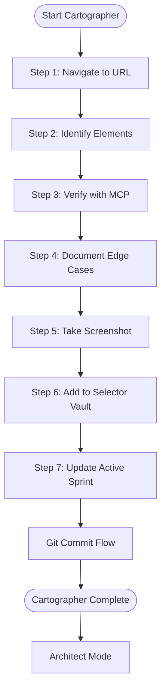

# Phase 2: Cartographer Mode (Discovery)

**When to Use:**

- Starting a new page/feature
- Investigating existing page changes
- Selector validation/audit

**Duration:** 10-20 minutes per page

**Philosophy:** "Map before you build. No code without verified selectors."

**Quick Copy:** [Prompt Template](../prompts/02_cartographer.md)

---

## Workflow Diagram



---

## Prompt Template

```
Activate **Cartographer Mode**.

**Context:** 
- Read `.ai/2_PLANNING/active_sprint.md`
- Read `.ai/1_CONTEXT/mission.md`

**Target:** [YOUR_TARGET_URL_HERE]

**Goal:** [WHAT_ELEMENTS_TO_MAP - e.g., "Map login form" or "Map product grid"]

**Tools Required:** 
- MCP server (playwright-community)

**Task Checklist:**
1. Launch browser (headed mode for visibility)
2. Navigate to target URL
3. Identify ALL interactive elements for the goal:
   - [Element type 1 - e.g., Input fields]
   - [Element type 2 - e.g., Buttons]
   - [Element type 3 - e.g., Links]
   - [Element type 4 - e.g., Validation messages]
   
4. For EACH element:
   - Use MCP `highlight_element` to verify it exists
   - Test the selector in browser console if needed
   - Record: Page | Element | Selector | Strategy | Date | Notes
   - Prefer this priority: data-testid > aria > id > semantic-class > text
   
5. Document edge cases:
   - Any elements requiring special waits?
   - Any elements in iframes or shadow DOM?
   - Any dynamic content?
   
6. Take full-page screenshot:
   - Save to `.ai/2_PLANNING/maps/[pagename]_[YYYYMMDD].png`
   - Annotate if helpful
   
7. Append verified selectors to `.ai/3_MEMORY/selector_vault.md`:
   - Use the standard format
   - Include verification date
   - Add notes for special cases
   
8. Update `active_sprint.md`:
   - Mark Cartographer task as [x] complete
   - Add any observations to Notes section

**Exit Criteria:**
- [ ] All target elements highlighted successfully (zero phantom selectors)
- [ ] Selector vault has entries for all mapped elements (minimum 3)
- [ ] Screenshot saved with descriptive filename
- [ ] No code written yet (this is discovery only)
- [ ] Active sprint updated

**Deliverable:** 
- Populated selector vault entries
- Screenshot in maps/ folder
- Updated active sprint

**IMPORTANT:** Use MCP tools to actually interact with the browser. Verify visually.
```

---

## Detailed Task Breakdown

### Step 1: Navigate to Target URL

Open the browser and navigate to the target page using MCP.

**Verification:**

- Page loads completely
- All images and assets loaded
- Page is interactive

---

### Step 2: Identify Target Elements

Survey the page and list all interactive elements that need selectors.

**Element Types to Look For:**

| Type | Examples | Priority |
|------|----------|----------|
| Inputs | Text fields, password fields, textareas | High |
| Buttons | Submit, cancel, action buttons | High |
| Messages | Error containers, success notifications | High |
| Dropdowns | Select elements, custom dropdowns | Medium |
| Links | Navigation, external links | Medium |
| Lists | Product grids, item lists | Medium |
| Modals | Popups, dialogs | Medium |
| Navigation | Menus, breadcrumbs, tabs | Low |

**Questions to Answer:**

- What is the primary user action on this page?
- What elements are required for that action?
- What validation/feedback elements exist?
- Are there any conditional elements?

---

### Step 3: Verify Each Selector with MCP

For EACH identified element, verify the selector works.

**MCP Command:**

```
playwright_hover
  selector: "#user-name"
```

If the element is highlighted/hovered, the selector is valid.

**Selector Strategy Priority:**

1. `data-testid` (Best)
2. `aria-label` (Good)
3. `id` (Good)
4. `semantic class` (Caution)
5. `text content` (Caution)

---

### Step 4: Document Edge Cases

Note any special handling requirements for elements.

| Case | Example | Vault Note |
|------|---------|------------|
| Async loading | Button disabled until data loads | `wait-enabled` |
| Conditional | Error message only on failure | `dynamic` |
| Inside iframe | Embedded payment form | `iframe` |

---

### Step 5: Take Screenshot

Capture the page for visual documentation.

**Location:** `.ai/2_PLANNING/maps/`

**Naming Convention:** `[pagename]_[YYYYMMDD].png`

---

### Step 6: Add to Selector Vault

Add all verified selectors to `.ai/3_MEMORY/selector_vault.md`.

**Vault Entry Format:**

```
Page | Element | Selector | Strategy | Verified | Notes
```

---

### Step 7: Update Active Sprint

Mark Cartographer task complete in active_sprint.md.

---

## Cartographer → Git Commit Flow

After Cartographer completes, commit the mapping work.

```
Activate **Git Commit Flow**.

**Context:**
- Read `.ai/1_CONTEXT/git_standards.md`
- Cartographer Mode just completed

**Pre-Commit Checklist:**
- [ ] Selector vault updated with new entries
- [ ] Screenshot saved to maps/
- [ ] Active sprint updated
- [ ] No code files created (Cartographer doesn't write code)

**Commit Type:** map
**Commit Scope:** [page-name]

**Task:**
1. Show me `git diff --staged` for review
2. Prepare commit message following the standard:
   - Type: map
   - Include: Number of selectors, page URL, screenshot filename
   - Reference: selector_vault.md
3. Ask for approval before committing
4. After approval, execute commit
5. Update active_sprint.md "Last Commit" reference
```

---

## Example Cartographer Commit

```bash
git commit -m "map(products): Map inventory page with 8 verified selectors

Cartographer Mode:
- Mapped https://www.saucedemo.com/inventory.html
- Verified 8 selectors via MCP highlight:
  * Product grid container
  * 6 product cards
  * Add to cart buttons
  * Shopping cart badge
  * Sort dropdown
- Screenshot: .ai/2_PLANNING/maps/products_20260110.png
- All selectors added to vault with verification dates

Selector Strategy:
- Prefer data-test attributes (SauceDemo standard)
- Product cards use stable class names
- Cart badge uses unique ID

Status: Cartographer complete
Next: Architect Mode - Build ProductsPage.ts

See: .ai/3_MEMORY/selector_vault.md"
```

---

## Exit Criteria Checklist

Before proceeding to Architect Mode:

- [ ] All target elements verified via MCP
- [ ] Zero phantom selectors (every selector tested)
- [ ] Selector vault updated with entries
- [ ] Screenshot saved with descriptive filename
- [ ] Active sprint updated
- [ ] No code written (discovery only)
- [ ] Git commit completed with `map` type

---

## Next Steps

After Cartographer and Git Commit Flow complete:

| Situation | Next Mode |
|-----------|-----------|
| Elements mapped successfully | [Architect](./03_architect.md) |
| Major page issues | Flag to team, update blockers |

---

## Related Documentation

- [Cartographer Prompt](../prompts/02_cartographer.md) - Copy-paste version
- [Selector Vault](../../3_MEMORY/selector_vault.md) - Selector storage
- [Architect Mode](./03_architect.md) - Next phase

---

**Cartographer Mode is complete. Ready for Git Commit Flow, then Architect Mode.**
