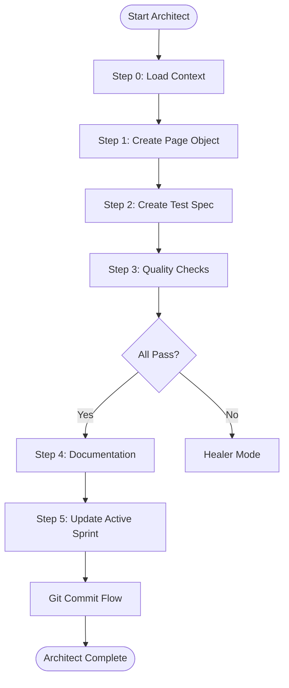
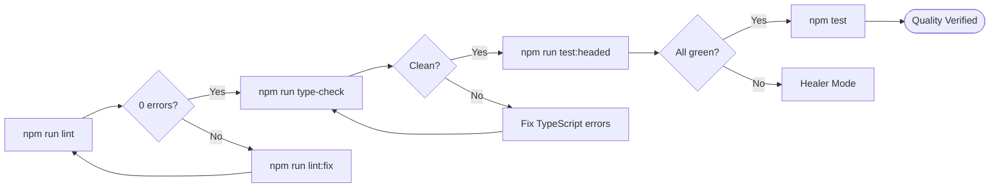

# Phase 3: Architect Mode (Implementation)

**When to Use:** After Cartographer completes, ready to write code

**Duration:** 20-40 minutes per page

**Philosophy:** "Strict construction. Only use verified selectors from the vault."

**Quick Copy:** [Prompt Template](../prompts/03_architect.md)

---

## Workflow Diagram



---

## Prompt Template

```
Activate **Architect Mode**.

**Context:**
- Read `.ai/3_MEMORY/selector_vault.md` (ONLY use these selectors)
- Read `.ai/1_CONTEXT/mission.md` (follow POM rules)
- Read `.ai/2_PLANNING/active_sprint.md` (know the goal)

**Target Page:** [PAGE_NAME]

**Task Checklist:**

### 1. Create Page Object
**Location:** `pages/[PageName]Page.ts`

**Requirements:**
- Extend BasePage class
- Use ONLY selectors from vault (from recent Cartographer run)
- Include all necessary methods:
  * Navigation (if not inherited from BasePage)
  * Interaction methods (fill, click, select, etc.)
  * Verification method: `isLoaded()`
  * Getter methods for dynamic content
  
**Example Structure:**
```typescript
export class [PageName]Page extends BasePage {
  // Selectors from vault as private readonly Locators

  constructor(page: Page) {
    super(page);
    // Initialize locators
  }
  
  // Action methods
  async [primaryAction]() { }
  
  // Verification methods
  async isLoaded() { }
  
  // Getter methods
  async get[Something]() { }
}
```

### 2. Create Test Spec

**Location:** `tests/[feature-name].spec.ts`

**Requirements:**

- Import the Page Object
- Write 3-5 test cases covering:
  - Happy path (primary user flow)
  - Edge cases (error handling, validation)
  - Verification (page loads correctly)

**Structure:**

```typescript
import { test, expect } from '@playwright/test';
import { [PageName]Page } from '../pages/[PageName]Page';

test.describe('[Feature Name]', () => {
  test('should [test case 1]', async ({ page }) => {
    // Arrange
    const pageObject = new [PageName]Page(page);
    
    // Act
    await pageObject.goto('[URL]');
    
    // Assert
    await pageObject.isLoaded();
    expect(...).toBe...();
  });
  
  // More test cases...
});
```

### 3. Code Quality Checks

Execute in order:

1. `npm run lint` - Fix all errors before proceeding
2. `npm run type-check` - Resolve all TypeScript errors
3. `npm run test:headed` - Watch tests run, verify behavior
4. If any test fails → Stop and activate Healer Mode
5. If all pass → `npm test` (headless verification)

### 4. Documentation

- Add JSDoc comments to complex methods
- Update selector vault if any selectors needed adjustment
- Add any special cases to active_sprint.md Notes

### 5. Update Active Sprint

- Mark Architect tasks as [x] complete
- Note any edge cases discovered
- Update "Last Completed Task"

**Exit Criteria:**

- [ ] Page Object created following POM pattern
- [ ] Test spec created with 3+ test cases
- [ ] All tests passing (green) in both headed and headless
- [ ] ESLint: 0 errors
- [ ] TypeScript: compiles successfully
- [ ] No hardcoded values (use fixtures/config)
- [ ] Active sprint updated

**Deliverable:**

- Working Page Object file
- Passing test spec file
- Updated active sprint

**CRITICAL:** If any test fails, STOP and activate Healer Mode immediately.

```

---

## Detailed Task Breakdown

### Step 1: Create Page Object

Create the Page Object file following the Page Object Model (POM) pattern.

**File Location:** `pages/[PageName]Page.ts`

**Template:**

```typescript
import { Page, Locator } from '@playwright/test';
import { BasePage } from './BasePage';

export class [PageName]Page extends BasePage {
  // Private readonly locators - from selector vault ONLY
  private readonly usernameField: Locator;

  constructor(page: Page) {
    super(page);
    this.usernameField = this.page.locator('#user-name');
  }

  async login(username: string) {
    await this.usernameField.fill(username);
  }

  async isLoaded() {
    await this.usernameField.waitFor({ state: 'visible' });
  }
}
```

---

### Step 2: Create Test Spec

Create the test specification file with multiple test cases.

**File Location:** `tests/[feature-name].spec.ts`

---

### Step 3: Code Quality Checks

Run all quality checks before proceeding.

**Commands:**

```bash
# 1. Lint check
npm run lint

# 2. Type check
npm run type-check

# 3. Headed test run
npm run test:headed -- tests/[filename].spec.ts

# 4. Final headless run
npm test -- tests/[filename].spec.ts
```

---

### Step 4: Documentation

Add documentation and notes for the implementation.

- Add JSDoc comments to public methods
- Update selector vault with any adjustments
- Update active_sprint.md notes

---

### Step 5: Update Active Sprint

Mark tasks complete and set focus for next session.

---

## Architect → Git Commit Flow

```
Activate **Git Commit Flow**.

**Context:**
- Read `.ai/1_CONTEXT/git_standards.md`
- Architect Mode just completed

**Pre-Commit Checklist:**
- [ ] All tests passing (npm test)
- [ ] Linter clean (npm run lint)
- [ ] Type check clean (npm run type-check)
- [ ] Page Object follows POM pattern
- [ ] No raw selectors in test specs
- [ ] Active sprint updated

**Commit Type:** feat (or arch if pure Page Object without tests)
**Commit Scope:** [page-name]

**Task:**
1. Stage files: `git add pages/ tests/ .ai/`
2. Show me `git diff --staged` for review
3. Prepare commit message:
   - Type: feat
   - Include: Page Object name, test count, test results
   - Reference: daily log if session complete
4. Ask for approval
5. Execute commit
6. Update active_sprint.md "Last Commit"
```

---

## Example Architect Commit

```bash
git commit -m "feat(products): Implement products page automation

Architect Mode:
- Created ProductsPage.ts with POM pattern
- Methods: addProductToCart(), sortProducts(), getProductCount()
- Created products.spec.ts with 4 test cases
  
Code Quality:
- ESLint: 0 errors
- TypeScript: clean
- All tests passing: 4/4 green
- Selectors: All from vault, verified via Cartographer

Status: Products page automated
Next: Cart page mapping

See: .ai/2_PLANNING/active_sprint.md"
```

---

## Exit Criteria Checklist

- [ ] Page Object created following POM pattern
- [ ] Test spec created with 3+ test cases
- [ ] All tests passing (headed and headless)
- [ ] ESLint: 0 errors
- [ ] TypeScript: clean
- [ ] No hardcoded values
- [ ] Active sprint updated
- [ ] Git commit completed with `feat` type

---

## Quality Gates



**Pass Criteria:**

| Check | Command | Criteria |
|-------|---------|----------|
| Lint | `npm run lint` | 0 errors |
| Types | `npm run type-check` | No compilation errors |
| Tests (headed) | `npm run test:headed` | All green |
| Tests (headless) | `npm test` | All green |

---

## Next Steps

| Situation | Next Mode |
|-----------|-----------|
| All tests passing | Continue or [Night Watchman](./06_night_watchman.md) |
| Test failures | [Healer](./04_healer.md) |
| New page needed | [Cartographer](./02_cartographer.md) |

---

## Related Documentation

- [Architect Prompt](../prompts/03_architect.md) - Copy-paste version
- [Selector Vault](../../3_MEMORY/selector_vault.md) - Verified selectors
- [Healer Mode](./04_healer.md) - When tests fail

---

**Architect Mode is complete. Ready for Git Commit Flow.**
