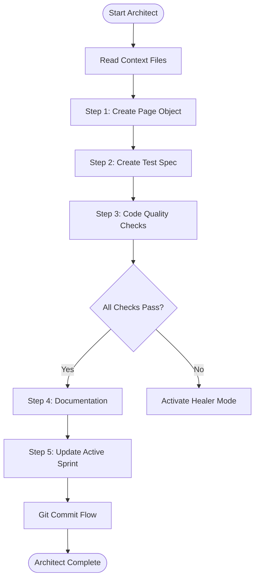

# Phase 3: Architect Mode (Implementation)

**When to Use:** After Cartographer completes, ready to write code

**Duration:** 20-40 minutes per page

**Philosophy:** "Strict construction. Only use verified selectors from the vault."

**Quick Copy:** [Prompt Template](../prompts/03_architect.md)

---

## Workflow Diagram



---

## Prompt Template

```
Activate **Architect Mode**.

**Context:**

- Read `.ai/3_MEMORY/selector_vault.md` (ONLY use these selectors)
- Read `.ai/1_CONTEXT/mission.md` (follow POM rules)
- Read `.ai/2_PLANNING/active_sprint.md` (know the goal)

**Target Page:** [PAGE_NAME]

**Task Checklist:**

1. Create Page Object in `pages/[PageName]Page.ts`
2. Create Test Spec in `tests/[feature-name].spec.ts`
3. Run code quality checks (lint, type-check, tests)
4. Add documentation (JSDoc, notes)
5. Update active_sprint.md with completed task

**Exit Criteria:**

- [ ] Page Object created following POM pattern
- [ ] Test spec created with 3+ test cases
- [ ] All tests passing (headed and headless)
- [ ] ESLint: 0 errors
- [ ] TypeScript: compiles successfully
- [ ] No hardcoded values
- [ ] Active sprint updated

**Deliverable:**

- Working Page Object file
- Passing test spec file
- Updated active sprint

**CRITICAL:** If any test fails, STOP and activate Healer Mode.
```

---

## Detailed Task Breakdown

### Step 1: Create Page Object

Create the Page Object Model file for the target page.

**File Location:** `pages/[PageName]Page.ts`

**Template:**

```typescript
import { Page, Locator } from '@playwright/test';
import { BasePage } from './BasePage';

/**
 * Page Object for [Page Description]
 * Selectors verified via Cartographer Mode on [DATE]
 * See: .ai/3_MEMORY/selector_vault.md
 */
export class [PageName]Page extends BasePage {
  // Private readonly locators - from selector vault ONLY
  private readonly usernameField: Locator;
  private readonly passwordField: Locator;
  private readonly loginButton: Locator;
  private readonly errorMessage: Locator;

  constructor(page: Page) {
    super(page);
    // Initialize locators using verified selectors
    this.usernameField = page.locator('#user-name');
    this.passwordField = page.locator('#password');
    this.loginButton = page.locator('#login-button');
    this.errorMessage = page.locator('.error-message-container');
  }

  /**
   * Verifies page is ready
   */
  async isLoaded(): Promise<void> {
    await this.usernameField.waitFor({ state: 'visible' });
    await this.loginButton.waitFor({ state: 'visible' });
  }

  /**
   * Login with credentials
   * @param username - Username to enter
   * @param password - Password to enter
   */
  async login(username: string, password: string): Promise<void> {
    await this.usernameField.fill(username);
    await this.passwordField.fill(password);
    await this.loginButton.click();
  }

  /**
   * Gets error message text if visible
   * @returns Error message or null
   */
  async getErrorMessage(): Promise<string | null> {
    const isVisible = await this.errorMessage.isVisible();
    if (!isVisible) {
      return null;
    }
    return await this.errorMessage.textContent();
  }
}
```

**Rules:**

| Rule | Description |
|------|-------------|
| Selectors | ONLY from vault (no inventing) |
| Inheritance | Must extend BasePage |
| Locators | Private readonly properties |
| Methods | JSDoc on all public methods |
| Types | Return types on all methods |

---

### Step 2: Create Test Spec

Create the test specification file with multiple test cases.

**File Location:** `tests/[feature-name].spec.ts`

**Template:**

```typescript
import { test, expect } from '@playwright/test';
import { LoginPage } from '../pages/LoginPage';

test.describe('Login Feature', () => {
  const baseURL = 'https://www.saucedemo.com';
  const validUser = 'standard_user';
  const validPass = 'secret_sauce';

  test('should display login page correctly', async ({ page }) => {
    // Arrange
    const loginPage = new LoginPage(page);

    // Act
    await loginPage.goto(baseURL);

    // Assert
    await loginPage.isLoaded();
    await expect(page).toHaveTitle(/Swag Labs/);
  });

  test('should login successfully with valid credentials', async ({ page }) => {
    // Arrange
    const loginPage = new LoginPage(page);
    await loginPage.goto(baseURL);
    await loginPage.isLoaded();

    // Act
    await loginPage.login(validUser, validPass);

    // Assert
    await expect(page).toHaveURL(/inventory/);
  });

  test('should show error with invalid credentials', async ({ page }) => {
    // Arrange
    const loginPage = new LoginPage(page);
    await loginPage.goto(baseURL);
    await loginPage.isLoaded();

    // Act
    await loginPage.login('invalid', 'invalid');

    // Assert
    const error = await loginPage.getErrorMessage();
    expect(error).not.toBeNull();
    expect(error).toContain('Username and password do not match');
  });
});
```

**Required Test Types:**

| Type | Purpose | Example |
|------|---------|---------|
| Display | Page loads correctly | Check title, URL, elements |
| Happy Path | Primary flow works | Login success |
| Error Case | Handle failures | Invalid credentials |
| Edge Case | Boundary conditions | Empty fields |

---

### Step 3: Code Quality Checks

Run all quality checks before proceeding.

**Commands:**

```bash
# 1. Lint check
npm run lint

# 2. If errors, auto-fix
npm run lint:fix

# 3. Type check
npm run type-check

# 4. Run tests (headed to observe)
npm run test:headed

# 5. If all pass, run headless
npm test
```

**Quality Gates:**


**Pass Criteria:**

| Check | Command | Criteria |
|-------|---------|----------|
| Lint | `npm run lint` | 0 errors |
| Types | `npm run type-check` | No errors |
| Tests (headed) | `npm run test:headed` | All green |
| Tests (headless) | `npm test` | All green |

---

### Step 4: Documentation

Add documentation and notes for the implementation.

**JSDoc Comments:**

```typescript
/**
 * Logs in with provided credentials
 * @param username - The username to enter
 * @param password - The password to enter
 * @throws Error if login form not visible
 */
async login(username: string, password: string): Promise<void> {
```

**Update Notes in active_sprint.md:**

```markdown
## Notes
- Login page uses stable ID selectors
- Error message only visible on failed login
- Password field masks input (type=password)
```

**Update Selector Vault (if needed):**

If any selector required adjustment, update the vault with the new selector and verification date.

---

### Step 5: Update Active Sprint

Mark the Architect task complete.

**Update active_sprint.md:**

```markdown
## Architect Tasks
- [x] Implement LoginPage.ts (3 tests passing)

## Notes
- Login automation complete
- Using stable ID selectors from vault
- Error handling verified
```

---

## Git Commit Flow

After completing all steps, commit the implementation.

```
Activate **Git Commit Flow**.

**Context:**

- Architect Mode just completed
- Read `.ai/1_CONTEXT/git_standards.md`

**Pre-Commit Checklist:**

- [ ] All tests passing
- [ ] Lint clean
- [ ] Type check clean
- [ ] Page Object follows POM
- [ ] No raw selectors in tests
- [ ] Active sprint updated

**Commit Type:** feat
**Commit Scope:** [page-name]

**Steps:**

1. Stage: `git add pages/ tests/ .ai/`
2. Review: `git diff --staged`
3. Commit with proper message
4. Update active_sprint.md with commit reference
```

---

## Example Commit Message

```bash
git commit -m "feat(login): Implement login page automation

Architect Mode:
- Created LoginPage.ts with POM pattern
- Methods: login(), isLoaded(), getErrorMessage()
- Created saucedemo-login.spec.ts with 3 tests:
  * Display verification
  * Successful login
  * Error handling

Code Quality:
- ESLint: 0 errors [PASS]
- TypeScript: clean [PASS]
- Tests: 3/3 green [PASS]
- Selectors: All from vault

Status: Login page automated
Next: Products page mapping

See: .ai/3_MEMORY/selector_vault.md"
```

---

## Exit Criteria Checklist

Before proceeding:

- [ ] Page Object in `pages/` directory
- [ ] Page Object extends BasePage
- [ ] All selectors from vault
- [ ] `isLoaded()` method implemented
- [ ] Test spec with 3+ tests
- [ ] All tests passing
- [ ] `npm run lint` - 0 errors
- [ ] `npm run type-check` - clean
- [ ] No hardcoded values
- [ ] JSDoc comments added
- [ ] Active sprint updated
- [ ] Git commit completed

---

## Common Patterns

### Waiting Strategies

```typescript
// Wait for page load
await this.page.waitForLoadState('networkidle');

// Wait for element visible
await this.element.waitFor({ state: 'visible' });

// Wait for element enabled
await expect(this.button).toBeEnabled();

// Wait for content
await expect(this.element).toHaveText(/expected/);
```

### Dynamic Content

```typescript
async getItemCount(): Promise<number> {
  await this.page.waitForLoadState('networkidle');
  return await this.itemList.count();
}
```

### Conditional Elements

```typescript
async getOptionalMessage(): Promise<string | null> {
  const isVisible = await this.message.isVisible();
  return isVisible ? await this.message.textContent() : null;
}
```

---

## Troubleshooting

### Test Fails Intermittently

**Symptom:** Test passes sometimes, fails other times

**Action:** Activate Healer Mode - likely timing issue. Add explicit waits.

---

### TypeScript Compilation Error

**Symptom:** `npm run type-check` shows errors

**Action:**

1. Check import paths
2. Verify method signatures
3. Add missing return types

---

### Lint Errors

**Symptom:** `npm run lint` shows errors

**Action:**

1. Run `npm run lint:fix`
2. Manually fix remaining
3. Check semicolons, unused imports

---

### Selector Not Found

**Symptom:** Test fails with "element not found"

**Action:**

1. Verify selector in vault
2. Check Cartographer date
3. Re-map page if changed

---

## Next Steps

After Architect and Git Commit Flow complete:

| Situation | Next Mode |
|-----------|-----------|
| All tests passing | Continue or [Night Watchman](./06_night_watchman.md) |
| Test failures | [Healer](./04_healer.md) |
| New page needed | [Cartographer](./02_cartographer.md) |
| Session ending | [Night Watchman](./06_night_watchman.md) |

---

## Related Documentation

- [Architect Prompt](../prompts/03_architect.md) - Copy-paste version
- [Selector Vault](../../3_MEMORY/selector_vault.md) - Verified selectors
- [Mission](../mission.md) - POM rules and standards
- [Healer Mode](./04_healer.md) - When tests fail

---

**Architect Mode is complete. Ready for Git Commit Flow.**
