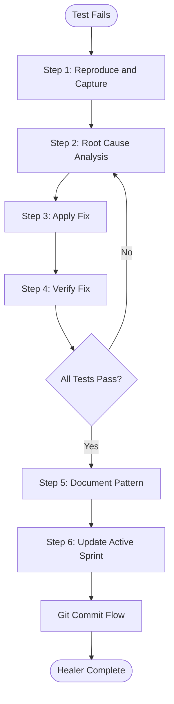
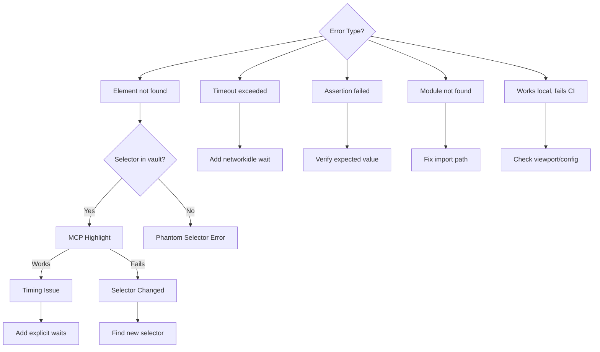

# Phase 4: Healer Mode (Maintenance and Fixes)

**When to Use:**

- Test fails unexpectedly
- Selector breaks after deployment
- Unexpected behavior detected
- CI/CD pipeline fails

**Duration:** 10-30 minutes depending on complexity

**Philosophy:** "Root cause analysis before hot-fixes. Consult institutional memory first."

**Quick Copy:** [Prompt Template](../prompts/04_healer.md)

---

## Workflow Diagram



---

## Prompt Template

```
Activate **Healer Mode**.

**Issue Description:**
[PASTE ERROR LOG OR DESCRIBE FAILURE HERE]

**Context:**

- Read `.ai/3_MEMORY/failure_patterns.md` (check if known issue)
- Read `.ai/3_MEMORY/selector_vault.md`
- Read `.ai/1_CONTEXT/decision_log.md`

**Task Checklist:**

1. Reproduce issue and capture evidence (screenshot, error log)
2. Perform root cause analysis (selector, timing, logic, environment)
3. Apply appropriate fix based on root cause
4. Verify fix passes (test 20 times for stability)
5. Document pattern in failure_patterns.md
6. Update active_sprint.md with healing activity

**Exit Criteria:**

- [ ] Test runs green
- [ ] Root cause identified and documented
- [ ] Fix applied and verified stable
- [ ] Failure pattern logged
- [ ] No regressions introduced
- [ ] Active sprint updated

**Deliverable:**

- Fixed test
- Documented failure pattern
- Updated documentation
```

---

## Detailed Task Breakdown

### Step 1: Reproduce and Capture Evidence

Run the failing test and capture all relevant information.

**Commands:**

```bash
# Run failing test with UI visible
npm run test:headed -- tests/failing-test.spec.ts

# Run with debug mode
npm run test:debug -- tests/failing-test.spec.ts
```

**Capture:**

| Item | How to Capture |
|------|----------------|
| Error message | Copy from terminal output |
| Stack trace | Copy from terminal output |
| Screenshot | MCP `playwright_screenshot` |
| URL | Note from browser |
| Console errors | Check browser DevTools |

**MCP Screenshot:**

```
playwright_screenshot
  name: "failure_checkout_20260115"
  fullPage: true
```

---

### Step 2: Root Cause Analysis

Determine what type of failure this is.

**Root Cause Decision Tree:**



**Investigation Checklist:**

- [ ] Check if selector exists in vault
- [ ] MCP highlight the failing selector
- [ ] Check git log for recent changes
- [ ] Check failure_patterns.md for known issue
- [ ] Compare local vs CI results

---

### Step 3: Apply Fix

Based on root cause, apply the appropriate fix.

#### If Selector Changed


**Steps:**

1. Use MCP to find new selector
2. Highlight to verify it works
3. Update selector_vault.md (deprecate old, add new)
4. Update Page Object with new selector
5. Re-run test

**Vault Update Example:**

```markdown
## Deprecated
Cart | SubmitBtn | button.old-class | css | 2026-01-10 | DEPRECATED 2026-01-15

## Active
Cart | SubmitBtn | button[data-testid="submit"] | testid | 2026-01-15 | New selector
```

---

#### If Timing Issue

**Fix Pattern:**

```typescript
// BEFORE (flaky)
async addToCart() {
  await this.addButton.click();
}

// AFTER (stable)
async addToCart() {
  await this.page.waitForLoadState('networkidle');
  await this.addButton.waitFor({ state: 'visible' });
  await this.addButton.waitFor({ state: 'enabled' });
  await this.addButton.click();
}
```

**Update vault note:** Add `wait-enabled` or `wait-net`

---

#### If Logic Issue

1. Fix the assertion to match actual behavior
2. Verify expected value is correct
3. Consider if this is a test bug or app bug

---

#### If Environment Issue

Update `playwright.config.ts`:

```typescript
export default defineConfig({
  use: {
    viewport: { width: 1920, height: 1080 },
  },
});
```

---

### Step 4: Verify Fix

Run comprehensive verification.

**Commands:**

```bash
# Run fixed test
npm run test:headed -- tests/fixed-test.spec.ts

# Run 20 times to verify stability
for i in {1..20}; do npm test -- tests/fixed-test.spec.ts || break; done

# Run full suite to check regressions
npm test

# Verify lint and types
npm run lint
npm run type-check
```

**Pass Criteria:**

| Check | Target |
|-------|--------|
| Single test | Pass |
| 20 consecutive runs | 20/20 pass |
| Full suite | No regressions |
| Lint | 0 errors |
| Type-check | Clean |

---

### Step 5: Document Pattern

Add entry to `.ai/3_MEMORY/failure_patterns.md`.

**Pattern Template:**

```markdown
## Pattern: [Descriptive Name]

**First Seen:** YYYY-MM-DD
**Frequency:** Rare | Occasional | Common
**Symptom:** [Error message]
**Root Cause:** [Why it happened]
**Fix:** [How to resolve]
**Prevention:** [How to avoid in future]
**Affected Tests:** [List of test files]
```

**Example:**

```markdown
## Pattern: Race Condition on Dynamic Button

**First Seen:** 2026-01-15
**Frequency:** Common (30% in CI)
**Symptom:** TimeoutError: locator.click: Target closed
**Root Cause:** Button disabled during async data load
**Fix:** Add waitFor({ state: 'enabled' }) before click
**Prevention:** Always wait for enabled on dynamic buttons
**Affected Tests:** products.spec.ts, cart.spec.ts
```

---

### Step 6: Update Active Sprint

Record the healing activity.

**Update active_sprint.md:**

```markdown
## Recent Healing Activities
- [x] Fixed race condition in products page (AD-012)
  - Root cause: Button disabled during data load
  - Fix: Added wait-enabled pattern
  - Pattern logged in failure_patterns.md
```

---

## Git Commit Flow

After completing all steps, commit the fix.

```
Activate **Git Commit Flow**.

**Context:**

- Healer Mode just completed
- Read `.ai/1_CONTEXT/git_standards.md`

**Pre-Commit Checklist:**

- [ ] Fixed test passing
- [ ] Full suite passing
- [ ] Pattern documented
- [ ] Vault updated (if selector changed)

**Commit Type:** heal
**Commit Scope:** [affected-area]

**Steps:**

1. Stage: `git add .`
2. Review: `git diff --staged`
3. Commit with heal message
4. Update active_sprint.md
```

---

## Example Commit Message

```bash
git commit -m "heal(products): Fix race condition in add-to-cart

Issue:
- Test failing intermittently (~30% in CI)
- Error: TimeoutError: locator.click: Target closed

Investigation:
- MCP screenshot showed button exists
- Button disabled during async data load
- CI network slower, exposes race condition

Resolution:
- Added waitFor({ state: 'enabled' }) before click
- Updated vault note: wait-enabled
- Pattern logged in failure_patterns.md

Verification:
- 20/20 consecutive passes
- Full suite green
- No regressions

See: .ai/3_MEMORY/failure_patterns.md"
```

---

## Common Fix Patterns

### Pattern 1: Selector Changed

```typescript
// Update Page Object
private readonly submitButton = this.page.locator('button[data-testid="submit"]');
```

### Pattern 2: Timing Issue

```typescript
await this.page.waitForLoadState('networkidle');
await this.element.waitFor({ state: 'visible' });
await this.element.waitFor({ state: 'enabled' });
```

### Pattern 3: Flaky Assertion

```typescript
// Use retry assertion
await expect(element).toHaveText(/expected/, { timeout: 10000 });
```

### Pattern 4: Environment Specific

```typescript
// playwright.config.ts
use: {
  viewport: { width: 1920, height: 1080 },
}
```

---

## Exit Criteria Checklist

Before marking Healer Mode complete:

- [ ] Test runs green
- [ ] 20/20 consecutive passes
- [ ] Full suite passes (no regressions)
- [ ] Root cause documented
- [ ] Pattern logged in failure_patterns.md
- [ ] Vault updated (if selector changed)
- [ ] Decision log updated (if AD created)
- [ ] Active sprint updated
- [ ] Lint passing
- [ ] Type-check passing
- [ ] Git commit prepared

---

## Troubleshooting

### Still Failing After Fix

**Symptom:** Test still fails after applying fix

**Action:**

1. Re-examine root cause
2. Check for multiple issues
3. Add more verbose logging
4. Consult team if stuck > 30 min

---

### Flaky After Fix

**Symptom:** Passes sometimes, fails sometimes

**Action:**

1. Run 20 times to measure flakiness rate
2. Add more explicit waits
3. Check for async behavior
4. Consider if fix is incomplete

---

### Fix Breaks Other Tests

**Symptom:** Original test passes but others fail

**Action:**

1. Check if fix changed shared code
2. Review Page Object changes
3. Verify selector changes don't affect other tests
4. May need to update multiple tests

---

## Pro Tips

### Always Check Failure Patterns First

```bash
grep -i "target closed" .ai/3_MEMORY/failure_patterns.md
```

### Use MCP for Visual Debugging

```
playwright_hover
  selector: "button.my-selector"
```

### Test Stability Thoroughly

```bash
for i in {1..20}; do npm test -- tests/fixed.spec.ts || break; done
```

### Document Everything

Every fix should result in a failure pattern entry, even for simple fixes.

---

## Next Steps

After Healer and Git Commit Flow complete:

| Situation | Next Mode |
|-----------|-----------|
| Fix complete | Continue or [Night Watchman](./06_night_watchman.md) |
| More tests failing | Continue Healer Mode |
| New page needed | [Cartographer](./02_cartographer.md) |
| Session ending | [Night Watchman](./06_night_watchman.md) |

---

## Related Documentation

- [Healer Prompt](../prompts/04_healer.md) - Copy-paste version
- [Failure Patterns](../../3_MEMORY/failure_patterns.md) - Known issues
- [Selector Vault](../../3_MEMORY/selector_vault.md) - Verified selectors
- [Decision Log](../decision_log.md) - Architectural decisions

---

**Healer Mode is complete. Ready for Git Commit Flow.**
