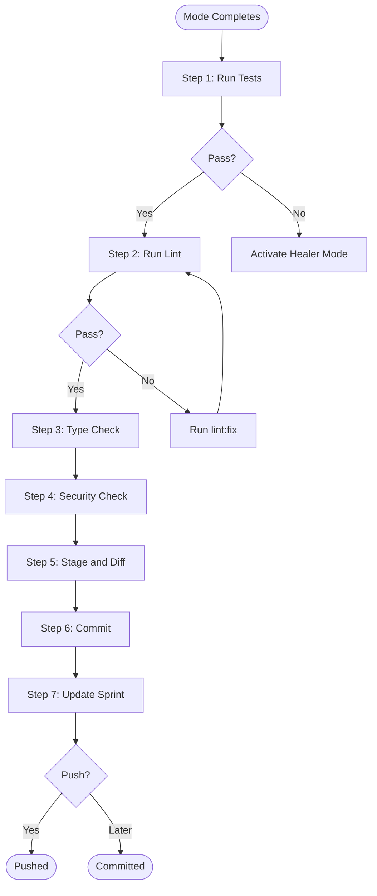

# Phase 5: Git Commit Flow (Universal)

**When to Use:** After ANY mode completes work that changes files

**Duration:** 3-5 minutes

**Philosophy:** "Every commit tells a story. Every change is traceable."

**Quick Copy:** [Prompt Template](../prompts/05_git_commit.md)

---

## Workflow Diagram



---

## Prompt Template

````
Activate **Git Commit Flow**.

**Context:**
- Read `.ai/1_CONTEXT/git_standards.md`
- Previous mode: [Cartographer/Architect/Healer/Other]

**Pre-Commit Checklist:**

Run these checks in order:
1. [ ] Tests status: `npm test`
   - If failed and not Healer Mode: Activate Healer Mode first
   - If passed: Continue
   
2. [ ] Lint status: `npm run lint`
   - If errors: Run `npm run lint:fix` to auto-fix what can be fixed
   - Manually fix remaining errors before committing
   - If passed: Continue
   
3. [ ] Type check: `npm run type-check`
   - If errors: Fix before committing
   - If passed: Continue
   
4. [ ] Security check:
   - [ ] No API keys in code
   - [ ] No passwords in code
   - [ ] No hardcoded file paths (e.g., /Users/username/...)
   - [ ] No .env files staged
   
5. [ ] Documentation check:
   - [ ] Active sprint updated
   - [ ] Daily log updated (if session ending)
   - [ ] Decision log updated (if decision made)
   - [ ] Selector vault updated (if selectors changed)
   - [ ] Failure patterns updated (if bug fixed)

**Commit Preparation:**

1. **Stage files:**
   ```bash
   git add .
   ```

2. **Show diff:**
   ```bash
   git diff --staged
   ```
   Present this to user for review

3. **Determine commit type:**
   - Cartographer: `map`
   - Architect (with tests): `feat`
   - Architect (Page Object only): `arch`
   - Healer: `heal` or `fix`
   - Documentation: `docs`
   - Dependencies: `chore`
   - Refactoring: `refactor`

4. **Prepare commit message:**
   Follow the standard from git_standards.md:
   - Subject line (max 72 chars)
   - Body with structured sections
   - Footer with references

5. **Show proposed commit:**
   ```
   I'm about to commit these changes:
   
   Type: [type]
   Scope: [scope]
   Subject: [subject]
   
   [Full commit message]
   
   Files changed: [count]
   Insertions: [count]
   Deletions: [count]
   
   Do you approve? (yes/no/edit)
   ```

6. **Execute commit (after approval):**
   ```bash
   git commit -m "[full message]"
   ```

7. **Update active_sprint.md:**
   Add to Quick Reference section:
   ```markdown
   **Last Commit:** [short-hash] - [subject line]
   ```

8. **Ask about push:**
   ```
   Committed successfully!
   Commit: [hash]
   
   Ready to push to remote? (yes/no/later)
   ```

**Exit Criteria:**
- [ ] All pre-commit checks passed
- [ ] User reviewed and approved diff
- [ ] Commit message follows standard
- [ ] Commit executed successfully
- [ ] Active sprint updated with commit reference
- [ ] User decided on push (executed or noted for later)

**Deliverable:** 
- Clean commit in git history
- Updated active sprint with commit reference
````

---

## Pre-Commit Checklist Detail

### Check 1: Tests

```bash
npm test
```

**Expected Result:**

```
Running 3 tests using 1 worker

  [PASS] tests/saucedemo-login.spec.ts:9:7 - should display login page correctly (2.1s)
  [PASS] tests/saucedemo-login.spec.ts:40:7 - should login successfully (1.8s)
  [PASS] tests/saucedemo-login.spec.ts:61:7 - should show error message (1.2s)

  3 passed (5.4s)
```

**If Failed:** Do NOT proceed. Activate Healer Mode first.

---

### Check 2: Lint

```bash
npm run lint
```

**Expected Result:**

```
No ESLint warnings or errors
```

**If Errors:**

```bash
# Auto-fix what can be fixed
npm run lint:fix

# Check again
npm run lint

# Manually fix remaining errors
```

---

### Check 3: Type Check

```bash
npm run type-check
```

**Expected Result:**

```
(no output = success)
```

**If Errors:** Fix TypeScript issues before committing.

---

### Check 4: Security

**Scan for secrets:**

```bash
# Check for common secret patterns
git diff --staged | grep -i "password\|secret\|api_key\|token"

# Check for hardcoded paths
git diff --staged | grep "/Users/\|/home/\|C:\\\\"
```

**Never commit:**

- API keys or tokens
- Passwords or secrets
- .env files
- Hardcoded file paths
- Personal information

---

### Check 5: Documentation

**Verify these files are updated as needed:**

| File | When to Update |
|------|----------------|
| `active_sprint.md` | Every commit |
| `selector_vault.md` | After Cartographer or selector changes |
| `decision_log.md` | After architectural decisions |
| `failure_patterns.md` | After Healer fixes |
| `lessons_learned.md` | After strategic insights |

---

## Commit Type Guide

| Mode | Type | When to Use |
|------|------|-------------|
| **Cartographer** | `map` | Mapping elements, adding selectors |
| **Architect** | `feat` | New feature with tests |
| **Architect** | `arch` | Page Object only (no tests) |
| **Healer** | `heal` | Fixing broken tests |
| **Healer** | `fix` | Minor bug fixes |
| **Any** | `refactor` | Code improvements |
| **Any** | `docs` | Documentation only |
| **Any** | `chore` | Dependencies, config |
| **Any** | `test` | Test-only changes |

---

## Commit Message Format

### Structure

```
type(scope): subject line (max 72 chars)

[Body - structured sections]

[Footer - references]
```

### Subject Line Rules

- Start with type and scope: `type(scope):`
- Use imperative mood: "Add" not "Added"
- Max 72 characters
- No period at the end
- Describe WHAT, not HOW

**Good:**

```
feat(products): Add product sorting functionality
```

**Bad:**

```
Added sorting to the products page.
```

---

## Commit Message Templates by Mode

### Cartographer Commit

```
map(page-name): Map [description] with N verified selectors

Cartographer Mode:
- Mapped [URL]
- Verified N selectors via MCP highlight:
  * [Element 1]
  * [Element 2]
  * [Element 3]
- Screenshot: .ai/2_PLANNING/maps/[filename].png
- All selectors added to vault

Selector Strategy:
- [Strategy notes]

Status: Cartographer complete
Next: [Next planned action]

See: .ai/3_MEMORY/selector_vault.md
```

---

### Architect Commit (feat)

```
feat(page-name): Implement [description]

Architect Mode:
- Created [PageName]Page.ts with POM pattern
- Methods: [list methods]
- Created [filename].spec.ts with N test cases:
  * [Test 1]
  * [Test 2]
  * [Test 3]

Code Quality:
- ESLint: 0 errors [PASS]
- TypeScript: clean [PASS]
- All tests passing: N/N green [PASS]
- Selectors: All from vault, verified via Cartographer

Status: [Description] automated
Next: [Next planned action]

See: .ai/2_PLANNING/active_sprint.md
```

---

### Healer Commit

```
heal(scope): Fix [issue description] (AD-XXX)

Issue:
- [Symptom description]
- [Failure rate/frequency]
- [Error message]

Investigation:
- [Investigation step 1]
- [Investigation step 2]
- [Root cause identified]

Resolution:
- [Fix applied]
- [Code changes made]
- [Vault/config updated]

Documentation:
- [Failure pattern logged]
- [Decision logged if applicable]

Verification:
- Ran test 20 times: 20/20 pass [PASS]
- Full suite: All tests passing [PASS]
- No regressions introduced [PASS]

Status: Healed successfully

Refs: AD-XXX
See: .ai/3_MEMORY/failure_patterns.md
```

---

### Documentation Commit

```
docs(scope): [Description]

Changes:
- [Change 1]
- [Change 2]

See: [Relevant files]
```

---

### Night Watchman Commit

```
docs(planning): Night Watchman rollover - YYYY-MM-DD

Session Summary:
- [Work completed]
- [Tests written]
- [Decisions made]

Daily Log:
- Created: .ai/2_PLANNING/daily_logs/YYYY-MM-DD.md
- Moved: All completed tasks and notes
- Preserved: Test results, healing activities

Active Sprint Cleanup:
- Removed: N completed tasks
- Remaining: N pending tasks
- Token health: [PASS] N lines (healthy)

Next Session Focus:
- [Next priority]

See: .ai/2_PLANNING/daily_logs/YYYY-MM-DD.md
```

---

## Workflow Steps

### Step 1: Stage Changes

```bash
git add .
```

Or stage specific files:

```bash
git add pages/ tests/
git add .ai/3_MEMORY/selector_vault.md
git add .ai/2_PLANNING/active_sprint.md
```

---

### Step 2: Review Diff

```bash
git diff --staged
```

**Review for:**

- Unexpected changes
- Debug code left in
- Console.log statements
- Commented-out code
- Hardcoded values

---

### Step 3: Create Commit

```bash
git commit -m "type(scope): subject

Body content here..."
```

For multi-line commits, use your editor:

```bash
git commit
```

---

### Step 4: Update Active Sprint

Add to active_sprint.md:

```markdown
## Quick Reference
**Last Commit:** abc1234 - feat(products): Implement products page automation
```

---

### Step 5: Push (Optional)

```bash
# Push current branch
git push

# Or push new branch
git push -u origin feature/branch-name
```

---

## Branch Strategy

### Before Starting New Work

```bash
# Create feature branch
git checkout -b feat/feature-name

# Or for fixes
git checkout -b fix/issue-description

# Or for mapping
git checkout -b map/page-name
```

### Branch Naming

| Type | Pattern | Example |
|------|---------|---------|
| Feature | `feat/description` | `feat/products-page` |
| Fix | `fix/description` | `fix/login-timeout` |
| Mapping | `map/page-name` | `map/checkout-flow` |
| Refactor | `refactor/description` | `refactor/page-objects` |
| Docs | `docs/description` | `docs/readme-update` |

---

## Exit Criteria Checklist

Before marking Git Commit Flow complete:

- [ ] `npm test` - All tests passing
- [ ] `npm run lint` - 0 errors
- [ ] `npm run type-check` - Clean
- [ ] No secrets in staged changes
- [ ] Diff reviewed and approved
- [ ] Commit message follows standard
- [ ] Commit executed successfully
- [ ] active_sprint.md updated with commit reference
- [ ] Push decision made (done or noted for later)

---

## Common Issues

### Merge Conflicts

```bash
# View conflicts
git status

# Fix conflicts in files, then
git add [fixed-files]
git commit
```

### Wrong Commit Message

```bash
# Amend last commit (before push)
git commit --amend -m "new message"
```

### Forgot to Stage File

```bash
# Add file to last commit (before push)
git add [forgotten-file]
git commit --amend --no-edit
```

### Need to Undo Last Commit

```bash
# Undo commit, keep changes staged
git reset --soft HEAD~1

# Undo commit, unstage changes
git reset HEAD~1
```

---

## Next Steps

After Git Commit Flow completes:

| Situation | Next Mode |
|-----------|-----------|
| More work to do | Back to [Cartographer](./02_cartographer.md) or [Architect](./03_architect.md) |
| Session ending | [Night Watchman](./06_night_watchman.md) |
| Break time | Note status, commit, push |

---

## Related Documentation

- [Git Commit Prompt](../prompts/05_git_commit.md) - Copy-paste version
- [Git Standards](../git_standards.md) - Commit message format
- [Active Sprint](../../2_PLANNING/active_sprint.md) - Current sprint state

---

**Git Commit Flow is complete. Changes are safely committed.**
