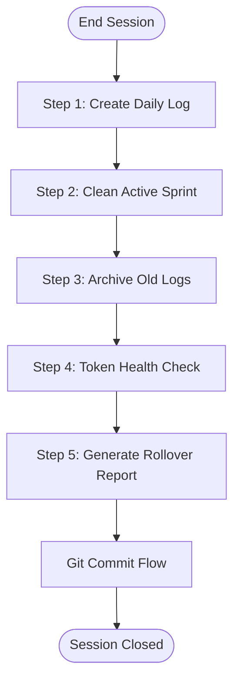

# Phase 6: Night Watchman Mode (Session Shutdown)

**When to Use:**

- End of work session
- Before long break
- When active_sprint.md gets too large (>100 lines)

**Duration:** 5-10 minutes

**Philosophy:** "Institutional memory is built session by session. Clean context is fast context."

**Quick Copy:** [Prompt Template](../prompts/06_night_watchman.md)

---

## Workflow Diagram



---

## Prompt Template

````
Activate **Night Watchman Mode**.

**Context:**
- Read `.ai/2_PLANNING/active_sprint.md`

**Task Checklist:**

### 1. Create Daily Log

**Path:** `.ai/2_PLANNING/daily_logs/[YYYY-MM-DD].md`

**Structure:**

```markdown
# Daily Log: [Month Day, Year]

## Summary: What was accomplished today
[2-3 sentence summary of the session]

## Metrics
- **Pages Mapped:** [count]
- **Selectors Verified:** [count]
- **Page Objects Created:** [count]
- **Tests Written:** [count]
- **Test Pass Rate:** [X/Y green]
- **Healing Activities:** [count]
- **Architectural Decisions:** [count]
- **Code Quality:** [ESLint/TypeScript status]

## Phase 1: Discovery (Cartographer Mode)
[Extract all completed [x] Cartographer tasks from active_sprint.md]

**Selectors Added:**
[List new vault entries]

## Phase 2: Implementation (Architect Mode)
[Extract all completed [x] Architect tasks from active_sprint.md]

**Files Created:**
[List new files]

**Test Cases:**
[List test descriptions]

## Phase 3: Validation
[Extract validation results]

## Healing Activities (if any)
[Extract from "Recent Healing Activities" section]

## Technical Notes
[Extract from "Notes" section - observations about the system]

## Decisions Made
[Reference any AD entries created today]

## Next Session Planning
**Suggested Next Steps:**
1. [Most logical next task]
2. [Alternative task]
3. [Another option]

**Recommended Focus:** [Top priority]

---
**Session Duration:** [hours]
**Overall Status:** [status description]
**Team Velocity:** [tests/session, pages/session]
```

### 2. Clean Active Sprint

Maintain a focused `active_sprint.md` for fast AI context loading.

**What to REMOVE (These move to the Daily Log):**

- All completed tasks marked with `[x]`
- All content from the "Notes" section (observations, ephemeral logs)
- All entries from "Recent Healing Activities"
- Old environment health check results

**What to KEEP (The persistent state):**

- **Sprint Goal:** The high-level objective
- **Status:** Current project health (e.g., 🟢 🟡 🔴)
- **Pending Tasks:** All unstarted or in-progress tasks
- **Blockers:** Any issues requiring human intervention
- **Quick Reference:** Current Page Object list, key URLs

**What to UPDATE:**

- **Last Completed Task:** Point to today's daily log hash or date
- **Next Session Focus:** Promote the top pending task
- **Quick Reference:** Last commit hash

**Target:** `active_sprint.md` should be **< 50 lines** after cleanup.

### 3. Archive Old Logs (if needed)

**If daily_logs/ has > 30 files:**

```bash
mkdir -p .ai/2_PLANNING/daily_logs/archive_[YYYY_MM]
mv .ai/2_PLANNING/daily_logs/[old-date]*.md .ai/2_PLANNING/daily_logs/archive_[YYYY_MM]/
```

### 4. Token Health Check

**Count lines:**

```bash
wc -l .ai/2_PLANNING/active_sprint.md
```

**Report:**

- If < 50 lines: "Token count healthy"
- If 50-100 lines: "Consider running Night Watchman more frequently"
- If > 100 lines: "CRITICAL: Token bloat detected, archive needed"

### 5. Generate Rollover Report

**Format:**

```
Night Watchman Report

Completed Today:

- [X] tasks completed
- [Y] files created
- [Z] tests written

Moved to Daily Log:

- Location: .ai/2_PLANNING/daily_logs/[date].md
- Size: [line count] lines

Active Sprint Status:

- Pending tasks: [count]
- Sprint completion: [%]
- Token health: [line count] lines

Next Session:

- Focus: [task description]
- Estimated effort: [time]
- Blockers: [none/list]

Ready for tomorrow!
```

**Exit Criteria:**

- [ ] Daily log created with all completed work
- [ ] active_sprint.md cleaned (< 100 lines, ideally < 50)
- [ ] Old logs archived (if needed)
- [ ] Token health confirmed
- [ ] Rollover report generated
- [ ] Sprint status updated

**Deliverable:**

- Comprehensive daily log
- Clean active sprint
- Rollover report
````

---

## Detailed Task Breakdown

### Task 1: Create Daily Log

Create a comprehensive record of the session's work.

**Path:** `.ai/2_PLANNING/daily_logs/[YYYY-MM-DD].md`

---

### Task 2: Clean Active Sprint

Maintain a focused `active_sprint.md` for fast AI context loading.

**Target Size:** < 50 lines

---

### Task 3: Token Health Check

Monitor the size of active planning files.

**Health Thresholds:**

| Lines | Status | Action |
|-------|--------|--------|
| < 50 | Healthy | No action needed |
| 50-100 | Warning | Clean up ASAP |
| > 100 | Critical | Manual archive required |

---

## Night Watchman Transfer to Git Commit Flow

```
Activate **Git Commit Flow**.

**Context:**

- Night Watchman just completed
- Session is ending

**Pre-Commit Checklist:**

- [ ] Daily log created
- [ ] Active sprint cleaned
- [ ] All previous work already committed

**Commit Type:** docs
**Commit Scope:** planning

**Task:**

1. Stage: `git add .ai/2_PLANNING/`
2. Show diff
3. Prepare commit message
4. Execute commit
5. Recommend: `git push`
```

---

## Example Night Watchman Commit

```bash
git commit -m "docs(planning): Night Watchman rollover - 2026-01-15

Session Summary:
- Completed login and products page automation

Daily Log:
- Created: .ai/2_PLANNING/daily_logs/2026-01-15.md
- Moved: All completed tasks and notes

Active Sprint Cleanup:
- Remaining: 3 pending tasks
- Token health: 42 lines (healthy)
"
```

---

## Next Steps

| Situation | Next Mode |
|-----------|-----------|
| Session end | Done |
| More work | [Morning Ritual](./01_morning_ritual.md) |

---

## Related Documentation

- [Night Watchman Prompt](../prompts/06_night_watchman.md) - Copy-paste version
- [Daily Logs](../../2_PLANNING/daily_logs/) - Previous session logs

---

**Night Watchman Mode is complete. Session properly closed.**
