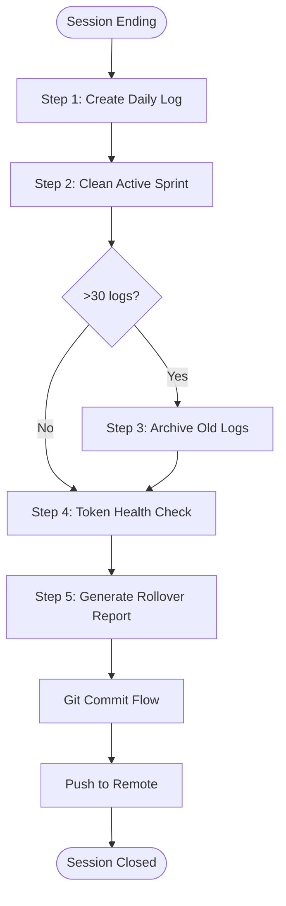

# Phase 6: Night Watchman Mode (Session Shutdown)

**When to Use:**

- End of work session
- Before long break
- When active_sprint.md gets too large (>100 lines)

**Duration:** 5-10 minutes

**Philosophy:** "Preserve context for future sessions. Token management is memory management."

**Quick Copy:** [Prompt Template](../prompts/06_night_watchman.md)

---

## Workflow Diagram



---

## Prompt Template

```
Activate **Night Watchman Mode**.

**Context:**
- Read `.ai/2_PLANNING/active_sprint.md`

**Task Checklist:**

1. Create Daily Log
   - Path: .ai/2_PLANNING/daily_logs/[YYYY-MM-DD].md
   - Include: Summary, Metrics, Completed Tasks, Notes, Next Steps
   - See detailed template below

2. Clean Active Sprint
   - REMOVE: All [x] completed tasks, Notes section content
   - KEEP: Pending [ ] tasks, Sprint goal, Blockers
   - UPDATE: Last Completed Task reference, Next Session Focus
   - Target: < 50 lines after cleanup

3. Archive Old Logs (if needed)
   - If daily_logs/ has > 30 files, archive older logs
   - Command: mkdir -p .ai/2_PLANNING/daily_logs/archive_[YYYY_MM]

4. Token Health Check
   - Run: wc -l .ai/2_PLANNING/active_sprint.md
   - < 50 lines = Healthy
   - 50-100 lines = Warning
   - > 100 lines = Critical

5. Generate Rollover Report
   - Tasks completed today
   - Files created
   - Daily log location
   - Pending tasks count
   - Next session focus

**Exit Criteria:**
- [ ] Daily log created with all completed work
- [ ] active_sprint.md cleaned (< 100 lines, ideally < 50)
- [ ] Old logs archived (if needed)
- [ ] Token health confirmed
- [ ] Rollover report generated
- [ ] Sprint status updated

**Deliverable:**
- Comprehensive daily log
- Clean active sprint
- Rollover report

**Note:** See Detailed Task Breakdown section below for full templates.
```

---

## Detailed Task Breakdown

### Task 1: Create Daily Log

**File Location:** `.ai/2_PLANNING/daily_logs/YYYY-MM-DD.md`

**File Naming:** Use ISO date format: `2026-01-15.md`

**Template:**

````
# Daily Log: January 15, 2026

#### Summary
Completed login and products page automation. Created 2 Page Objects and 7 test cases. 
Fixed one race condition issue via Healer Mode.

---

## Metrics

| Metric | Value |
|--------|-------|
| Pages Mapped | 2 |
| Selectors Verified | 12 |
| Page Objects Created | 2 |
| Tests Written | 7 |
| Test Pass Rate | 7/7 (100%) |
| Healing Activities | 1 |
| Architectural Decisions | 1 |
| Code Quality | ESLint: 0 errors, TypeScript: clean |

---

## Cartographer Mode (Discovery)

### Login Page
- Mapped: https://www.saucedemo.com/
- Selectors: 4 verified
- Screenshot: .ai/2_PLANNING/maps/login_20260115.png

### Products Page
- Mapped: https://www.saucedemo.com/inventory.html
- Selectors: 8 verified
- Screenshot: .ai/2_PLANNING/maps/products_20260115.png

**Selectors Added to Vault:**

| Page | Element | Selector | Strategy |
|------|---------|----------|----------|
| Login | UsernameField | #user-name | id |
| Login | PasswordField | #password | id |
| Login | LoginButton | #login-button | id |
| Login | ErrorMessage | .error-message-container | css |
| Products | ProductGrid | .inventory_list | css |
| Products | ProductCard | .inventory_item | css |
| Products | AddToCart | `button[data-test*="add-to-cart"]` | testid |
| Products | CartBadge | .shopping_cart_badge | css |

---

## Architect Mode (Implementation)

### SauceDemoLoginPage.ts
- Location: pages/SauceDemoLoginPage.ts
- Methods: login(), isLoaded(), getErrorMessage()
- Extends: BasePage

### saucedemo-login.spec.ts
- Location: tests/saucedemo-login.spec.ts
- Test Cases:
  1. should display login page correctly
  2. should login successfully with valid credentials
  3. should show error message with invalid credentials

---

## Validation Results

- npm test: 3 passed (5.4s)
- npm run lint: 0 errors
- npm run type-check: Clean

---

## Healing Activities

### Race Condition Fix
- Issue: Cart button click failing intermittently
- Root Cause: Button not enabled before click
- Fix: Added waitFor({ state: 'enabled' })
- Pattern: Logged in failure_patterns.md

---

## Technical Notes

- SauceDemo uses data-test attributes (good for testing)
- Cart badge only visible when items in cart
- Login form has no ARIA labels (accessibility concern)
- Products page loads async, needs networkidle wait

---

## Decisions Made

- AD-012: Wait for button enabled before click

---

## Next Session Planning

**Suggested Next Steps:**
1. Map Cart page (Cartographer Mode)
2. Map Checkout flow (Cartographer Mode)
3. Implement ProductsPage.ts (Architect Mode)

**Recommended Focus:** Cart page mapping

---

**Session Duration:** 2 hours
**Overall Status:** Productive session, on track
**Velocity:** 3.5 tests/hour
````

---

### Task 2: Clean Active Sprint

**Before Cleanup:**

```markdown
## Active Sprint

### Sprint Goal
Automate SauceDemo login and products pages

### Cartographer Tasks
- [x] Map login page (4 selectors)
- [x] Map products page (8 selectors)
- [ ] Map cart page
- [ ] Map checkout page

### Architect Tasks
- [x] Create LoginPage.ts
- [x] Create login.spec.ts (3 tests)
- [ ] Create ProductsPage.ts
- [ ] Create products.spec.ts

### Notes
- SauceDemo uses data-test attributes
- Cart badge only visible when items added
- Login has no ARIA labels

### Recent Healing Activities
- Fixed race condition in cart button (AD-012)
```

**After Cleanup:**

```markdown
## Active Sprint

### Sprint Goal
Automate SauceDemo login and products pages

### Pending Tasks
- [ ] Map cart page (Cartographer)
- [ ] Map checkout page (Cartographer)
- [ ] Create ProductsPage.ts (Architect)
- [ ] Create products.spec.ts (Architect)

### Quick Reference
**Last Completed Task:** See .ai/2_PLANNING/daily_logs/2026-01-15.md
**Last Commit:** abc1234 - feat(login): Implement login page automation
**Next Session Focus:** Cart page mapping
```

**Target:** < 50 lines, ideally < 30 lines

---

### Task 3: Archive Old Logs

**When to archive:** More than 30 files in daily_logs/

**Commands:**

```bash
# Count log files
ls -1 .ai/2_PLANNING/daily_logs/*.md | wc -l

# Create archive folder
mkdir -p .ai/2_PLANNING/daily_logs/archive_2026_01

# Move old files (keep last 30 days)
mv .ai/2_PLANNING/daily_logs/2025-12-*.md .ai/2_PLANNING/daily_logs/archive_2026_01/
```

**Archive Naming:** `archive_YYYY_MM`

---

### Task 4: Token Health Check

**Run count:**

```bash
wc -l .ai/2_PLANNING/active_sprint.md
```

**Health Thresholds:**

| Lines | Status | Action |
|-------|--------|--------|
| < 30 | Excellent | No action needed |
| 30-50 | Healthy | Acceptable |
| 50-100 | Warning | Run Night Watchman more often |
| > 100 | Critical | Immediate cleanup required |

**Why it matters:**

- AI context windows are limited
- Large files = more tokens = less capacity for work
- Clean sprint = efficient sessions

---

### Task 5: Generate Rollover Report

**Sample Report:**

```
Night Watchman Report
=====================

Completed Today:
- 4 tasks completed
- 2 files created
- 7 tests written

Moved to Daily Log:
- Location: .ai/2_PLANNING/daily_logs/2026-01-15.md
- Size: 127 lines

Active Sprint Status:
- Pending tasks: 4
- Sprint completion: 40%
- Token health: [PASS] 28 lines (excellent)

Next Session:
- Focus: Cart page mapping (Cartographer Mode)
- Estimated effort: 30-45 minutes
- Blockers: None

Ready for tomorrow!
```

---

## Night Watchman to Git Commit Flow

After Night Watchman completes:

```
Activate **Git Commit Flow**.

**Context:**
- Night Watchman just completed
- Session is ending

**Pre-Commit Checklist:**
- [ ] Daily log created
- [ ] Active sprint cleaned
- [ ] All previous work already committed

**Commit Type:** docs
**Commit Scope:** planning

**Task:**
1. Stage: `git add .ai/2_PLANNING/`
2. Show diff
3. Prepare commit:
   - Type: docs
   - Subject: "Night Watchman rollover - [date]"
   - Body: Summary of what was moved to daily log
4. Execute commit
5. Recommend: `git push` to preserve work

**Deliverable:** Session properly closed and documented
```

---

## Example Night Watchman Commit

```bash
git add .
git commit -m "docs(planning): Night Watchman rollover - 2026-01-15

Session Summary:
- Completed login and products page automation
- 7 total tests written (all passing)
- 2 Page Objects created
- 12 selectors added to vault
- 1 healing activity (race condition fix)
- 1 architectural decision (AD-012)

Daily Log:
- Created: .ai/2_PLANNING/daily_logs/2026-01-15.md
- Moved: All completed tasks and notes
- Preserved: Test results, healing activities, decisions

Active Sprint Cleanup:
- Removed: 4 completed tasks
- Remaining: 4 pending tasks
- Token health: [PASS] 28 lines (excellent)

Next Session Focus:
- Cart page mapping (Cartographer Mode)

See: .ai/2_PLANNING/daily_logs/2026-01-15.md"

git push
```

---

## Exit Criteria Checklist

Before marking Night Watchman complete:

- [ ] Daily log created with date filename
- [ ] All completed tasks moved to daily log
- [ ] All notes moved to daily log
- [ ] Healing activities documented
- [ ] active_sprint.md cleaned
- [ ] Pending tasks remain in active sprint
- [ ] Line count < 100 (ideally < 50)
- [ ] Old logs archived if > 30 files
- [ ] Rollover report generated
- [ ] Git commit prepared
- [ ] Ready to push

---

## Common Issues

### Active Sprint Still Too Long

**Solution:**

1. Be more aggressive in removing completed tasks
2. Summarize notes instead of copying verbatim
3. Move blockers to separate blockers.md if persistent

### Missing Daily Logs Folder

**Solution:**

```bash
mkdir -p .ai/2_PLANNING/daily_logs
```

### Forgot to Run Night Watchman

**Solution:**

1. Run it now, even if next session started
2. Use "Last session: [date]" naming
3. Don't lose the context

---

## Next Steps

After Night Watchman and Git Commit Flow:

| Action | Command |
|--------|---------|
| Push changes | `git push` |
| Shut down | Log off, rest |
| Continue working | Start new [Morning Ritual](./01_morning_ritual.md) |

---

## Related Documentation

- [Night Watchman Prompt](../prompts/06_night_watchman.md) - Copy-paste version
- [Active Sprint](../../2_PLANNING/active_sprint.md) - Current sprint state
- [Daily Logs](../../2_PLANNING/daily_logs/) - Previous session logs

---

**Night Watchman Mode is complete. Session properly closed.**
