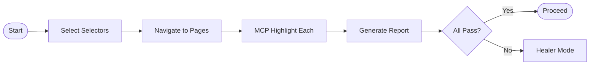

# Phase 7: Continuous Modes (On Demand)

**When to Use:** As needed, independent of the main workflow cycle

**Philosophy:** "Specialized tools for specialized situations."

**Quick Copy:** [Smoke Test](../prompts/07_smoke_test.md) | [Archaeology](../prompts/08_archaeology.md)

---

## Available Continuous Modes

| Mode | Purpose | Duration |
|------|---------|----------|
| **Smoke Test** | Quick health check of existing selectors | 5-10 min |
| **Archaeology** | Audit legacy code and plan migration | 30-60 min |

### Smoke Test Workflow



### Archaeology Workflow


---

## Smoke Test Mode

### When to Use

- Start of day (before Morning Ritual)
- After deployments to production/staging
- Before major changes
- Weekly health check
- After long period of inactivity

### Duration

5-10 minutes

### Prompt Template

```
Activate **Smoke Test Mode**.

**Context:**
- Read `.ai/3_MEMORY/selector_vault.md`

**Task:**
1. Sample 5-10 selectors across different pages
2. Use MCP to navigate to each page
3. Use MCP highlight to verify each selector works
4. Record: [PASS] Working or [FAIL] Broken
5. Generate health report
6. If failures: Flag for Healer Mode

**Exit Criteria:**
- [ ] Minimum 5 selectors tested
- [ ] Each page visited at least once
- [ ] Health report generated
- [ ] Failures flagged (if any)

**Deliverable:** Selector health report
```

---

### Smoke Test Procedure

#### Step 1: Select Selectors to Test

Choose 5-10 selectors from different pages:

```markdown
Selected for Smoke Test:
- Login | UsernameField | #user-name
- Login | LoginButton | #login-button
- Products | ProductGrid | .inventory_list
- Products | AddToCart | button[data-test*="add-to-cart"]
- Cart | CheckoutButton | #checkout
```

**Selection Criteria:**

- Cover all major pages
- Include critical user flows
- Mix of selector strategies
- Include recently added selectors

---

#### Step 2: Run Verification

For each selector:

```javascript
// Navigate to page
[MCP] navigate("https://www.saucedemo.com")

// Highlight selector
[MCP] highlight_element("#user-name")

// Record result
// If highlighted = [PASS]
// If not found = [FAIL]
```

---

#### Step 3: Generate Health Report

```
Smoke Test Report
=================
Date: 2026-01-15
Time: 09:15 AM

Results:
--------
Login | UsernameField | #user-name ............... [PASS]
Login | LoginButton | #login-button .............. [PASS]
Products | ProductGrid | .inventory_list ......... [PASS]
Products | AddToCart | button[data-test*=...] .... [PASS]
Cart | CheckoutButton | #checkout ................ [FAIL]

Summary:
--------
Total Tested: 5
Passing: 4
Failing: 1
Health: 80%

Failures Requiring Attention:
-----------------------------
- Cart | CheckoutButton | #checkout
   - Action: Activate Healer Mode
   - Priority: High

Recommendation:
---------------
[WARN] 1 failing selector detected
Action Required: Activate Healer Mode before proceeding
```

---

#### Step 4: Handle Failures

**If all pass:**

- Proceed with planned work
- Note in active_sprint.md: "Smoke test passed"

**If failures found:**

1. Document failures in active_sprint.md
2. Activate Healer Mode for each failure
3. Do not proceed with new features until fixed

---

### Smoke Test Checklist

```
[ ] SELECT SELECTORS
    [ ] Choose 5-10 from vault
    [ ] Cover different pages
    [ ] Include critical paths

[ ] RUN TESTS
    [ ] Navigate to each page
    [ ] Highlight each selector
    [ ] Record pass/fail

[ ] GENERATE REPORT
    [ ] List all results
    [ ] Calculate health percentage
    [ ] Identify failures

[ ] TAKE ACTION
    [ ] If all pass: proceed
    [ ] If failures: Healer Mode first
```

---

## Archaeology Mode

### When to Use

- Inheriting an existing test suite
- Auditing old tests for quality
- Planning migration to new patterns
- Evaluating technical debt
- Onboarding to new project

### Duration

30-60 minutes

### Prompt Template

```
Activate **Archaeology Mode**.

**Context:**
- Read `.ai/1_CONTEXT/mission.md`

**Task:**
1. Scan tests/ directory for all test files
2. Scan pages/ directory for all Page Objects
3. Extract all locators from code
4. Check POM usage and patterns
5. Analyze selector strategies used
6. Use MCP to verify critical selectors
7. Generate audit report
8. Create migration plan

**Exit Criteria:**
- [ ] All test files catalogued
- [ ] All Page Objects catalogued
- [ ] Selector strategies analyzed
- [ ] POM compliance checked
- [ ] Critical selectors verified
- [ ] Audit report generated
- [ ] Migration plan created (if needed)

**Deliverable:** 
- Comprehensive audit report
- Migration plan (if improvements needed)
```

---

### Archaeology Procedure

#### Step 1: Inventory Existing Code

**Scan test files:**

```bash
# List all test files
find tests/ -name "*.spec.ts" -o -name "*.test.ts"

# Count tests per file
grep -c "test\(" tests/*.spec.ts
```

**Scan Page Objects:**

```bash
# List all Page Objects
find pages/ -name "*.ts"

# Check for BasePage pattern
grep -l "extends BasePage" pages/*.ts
```

---

#### Step 2: Extract and Analyze Locators

**Find all locators:**

```bash
# Find raw locators in test files (should be zero)
grep -n "page.locator" tests/*.spec.ts

# Find locators in Page Objects (expected)
grep -n "page.locator\|this.page.locator" pages/*.ts
```

**Analyze selector strategies:**

| Strategy | Pattern | Count |
|----------|---------|-------|
| data-testid | `[data-testid=` | ? |
| data-test | `[data-test=` | ? |
| ID | `#` | ? |
| Class | `.` | ? |
| XPath | `//` | ? |
| Text | `text=` | ? |

---

#### Step 3: Check POM Compliance

**Compliance criteria:**

| Check | Pass Criteria |
|-------|---------------|
| BasePage exists | `pages/BasePage.ts` present |
| All POs extend BasePage | `extends BasePage` in all |
| No raw locators in tests | Zero `page.locator` in `tests/` |
| Selectors in vault | All PO selectors documented |
| isLoaded() method | Present in all Page Objects |

---

#### Step 4: Verify Critical Selectors

**For each Page Object, test key selectors:**

```javascript
// Test login page selectors
[MCP] navigate("https://site.com/login")
[MCP] highlight_element("#user-name")
[MCP] highlight_element("#password")
[MCP] highlight_element("#login-button")
```

---

#### Step 5: Generate Audit Report

```markdown
# Archaeology Audit Report
Date: 2026-01-15

## Inventory

### Test Files
| File | Tests | Status |
|------|-------|--------|
| login.spec.ts | 3 | [PASS] |
| products.spec.ts | 4 | [WARN] |
| cart.spec.ts | 2 | [FAIL] |

### Page Objects
| File | Extends BasePage | isLoaded() | Status |
|------|-----------------|------------|--------|
| LoginPage.ts | Yes | Yes | [PASS] |
| ProductsPage.ts | Yes | No | [WARN] |
| CartPage.ts | No | No | [FAIL] |

## Selector Analysis

| Strategy | Count | Percentage |
|----------|-------|------------|
| data-testid | 12 | 60% |
| ID | 5 | 25% |
| Class | 2 | 10% |
| XPath | 1 | 5% |

**Recommendation:** Migrate XPath selectors to data-testid

## POM Compliance

| Check | Result |
|-------|--------|
| BasePage exists | [PASS] |
| All extend BasePage | [FAIL] - CartPage missing |
| No raw locators in tests | [WARN] - 2 found in products.spec |
| Selectors in vault | [FAIL] - 8 missing |
| isLoaded() methods | [WARN] - 1 missing |

Critical Issues:
-----------------------------
- **CartPage.ts** - Does not extend BasePage
- **products.spec.ts** - Contains raw locators
- **Selector vault** - 8 selectors not documented
- **XPath usage** - 1 XPath selector found

Recommendations:
-----------------------------
- Refactor CartPage to extend BasePage
- Move raw locators from products.spec to ProductsPage
- Run Cartographer Mode to verify and document missing selectors
- Replace XPath with data-testid
```

---

#### Step 6: Create Migration Plan

```markdown
# Migration Plan

## Priority 1: Critical Fixes (Week 1)
- [ ] Refactor CartPage.ts to extend BasePage
- [ ] Add isLoaded() to ProductsPage.ts
- [ ] Remove raw locators from products.spec.ts

## Priority 2: Documentation (Week 1-2)
- [ ] Run Cartographer Mode on all pages
- [ ] Add 8 missing selectors to vault
- [ ] Document all Page Objects

## Priority 3: Improvements (Week 2-3)
- [ ] Replace XPath selector with data-testid
- [ ] Add JSDoc to all Page Objects
- [ ] Create missing test cases

## Priority 4: Technical Debt (Ongoing)
- [ ] Review selector strategies monthly
- [ ] Run Smoke Test weekly
- [ ] Update documentation after changes

## Estimated Effort
- Critical: 2-3 hours
- Documentation: 3-4 hours
- Improvements: 2-3 hours
- Total: ~10 hours
```

---

### Archaeology Checklist

```
[ ] INVENTORY
    [ ] List all test files
    [ ] List all Page Objects
    [ ] Count tests per file
    [ ] Check BasePage presence

[ ] ANALYZE
    [ ] Extract all locators
    [ ] Count by strategy type
    [ ] Check POM compliance
    [ ] Find raw locators in tests

[ ] VERIFY
    [ ] Test critical selectors via MCP
    [ ] Note any failures
    [ ] Check against vault

[ ] REPORT
    [ ] Generate audit report
    [ ] Identify critical issues
    [ ] Make recommendations

[ ] PLAN
    [ ] Create migration plan
    [ ] Prioritize fixes
    [ ] Estimate effort
    [ ] Schedule work
```

---

## When to Use Each Mode

| Situation | Mode | Priority |
|-----------|------|----------|
| Starting new day | Smoke Test | Recommended |
| After deployment | Smoke Test | Required |
| Weekly check | Smoke Test | Required |
| New project | Archaeology | Required |
| Inherited codebase | Archaeology | Required |
| Before major refactor | Archaeology | Recommended |
| After long break | Both | Recommended |

---

## Integration with Main Workflow

### Smoke Test Integration

```
Morning Ritual
    |
    v
[Optional: Smoke Test Mode]
    |
    v
Cartographer/Architect/Healer
    |
    v
Git Commit Flow
    |
    v
Night Watchman
```

### Archaeology Integration

```
[New Project/Inherited Code]
    |
    v
Archaeology Mode (one-time)
    |
    v
Migration Plan Execution
    |
    v
Normal Workflow
```

---

## Related Documentation

- [Smoke Test Prompt](../prompts/07_smoke_test.md) - Copy-paste version
- [Archaeology Prompt](../prompts/08_archaeology.md) - Copy-paste version
- [Selector Vault](../../3_MEMORY/selector_vault.md) - Verified selectors
- [Mission](../mission.md) - Core principles

---

**Continuous Modes are complete. Use as needed.**
