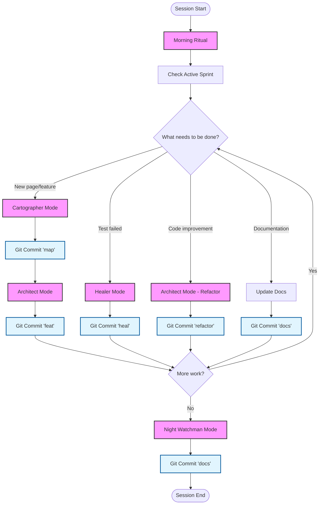

# Workflow Quick Reference

A condensed reference card for the 7-Phase Daily Workflow.

**Quick Link:** [Copy-Paste Prompts](../prompts/README.md) - Ready-to-use prompt templates

---

## Mode Selection Guide

| Situation | Mode | Duration |
|-----------|------|----------|
| **Session start** | [Morning Ritual](./01_morning_ritual.md) | 2-5 min |
| **New page** | [Cartographer](./02_cartographer.md) then [Architect](./03_architect.md) | 30-60 min |
| **Test fails** | [Healer](./04_healer.md) | 10-30 min |
| **Selector breaks** | [Healer](./04_healer.md) | 10-20 min |
| **Code cleanup** | [Architect](./03_architect.md) (refactor) | 20-40 min |
| **Session end** | [Night Watchman](./06_night_watchman.md) | 5-10 min |
| **Weekly check** | [Smoke Test](./07_continuous_modes.md) | 5-10 min |
| **Inherited code** | [Archaeology](./07_continuous_modes.md) | 30-60 min |

---

## Commit Type Guide

| Action | Type | Example |
|--------|------|---------|
| **Map elements** | `map` | `map(products): Map inventory page` |
| **Create feature** | `feat` | `feat(login): Add login automation` |
| **Fix bug** | `fix` | `fix(cart): Correct price calculation` |
| **Heal test** | `heal` | `heal(checkout): Fix race condition` |
| **Refactor** | `refactor` | `refactor(pages): Extract base methods` |
| **Update docs** | `docs` | `docs(readme): Update installation` |
| **Dependencies** | `chore` | `chore(deps): Update Playwright` |

---

## Workflow Decision Tree



---

## Success Metrics

### Daily Metrics

| Metric | Target | Measurement |
|--------|--------|-------------|
| Phantom Selectors | 0 | Cartographer verification working |
| Test Pass Rate | >95% | Quality of implementation |
| Commit Frequency | 3-5/session | Proper segmentation |
| Active Sprint Size | <50 lines | Token management |

### Weekly Metrics

| Metric | Target | Measurement |
|--------|--------|-------------|
| Pages Automated | Track growth | Coverage progress |
| Selector Stability | >95% | Re-run old tests |
| Failure Patterns | Document all | Known issues tracked |
| Decision Velocity | 1-3 ADs/week | Documented decisions |

### Monthly Metrics

| Metric | Target | Measurement |
|--------|--------|-------------|
| Test Suite Size | Growing | Total test count |
| Feature Coverage | Prioritized | Features automated |
| Healing Frequency | Decreasing | How often tests break |
| Documentation Quality | Complete | Daily logs maintained |

---

## Best Practices

### Do

- Always run Morning Ritual at session start
- Always use Cartographer before Architect
- Always commit after each mode completes
- Always show diff before committing
- Always run Night Watchman at session end
- Always document decisions (AD log)
- Always document failures (failure patterns)

### Do Not

- Never write code without verifying selectors first
- Never commit without running tests
- Never skip mode phases
- Never commit directly to main (use feature branches)
- Never commit secrets or hardcoded paths
- Never let active_sprint.md exceed 100 lines
- Never skip documentation updates

---

## Pre-Commit Checklist

```
[ ] npm test - All tests passing
[ ] npm run lint - 0 errors
[ ] npm run type-check - No errors
[ ] No secrets in staged changes
[ ] Diff reviewed
[ ] Commit message follows standard
[ ] active_sprint.md updated
```

---

## Exit Criteria Summary

| Mode | Key Exit Criteria |
|------|-------------------|
| **Morning Ritual** | Environment healthy, context loaded |
| **Cartographer** | All selectors highlighted, vault populated, screenshot saved |
| **Architect** | POM pattern used, 3+ tests passing, lint/types clean |
| **Healer** | Root cause found, fix verified, pattern logged |
| **Git Commit** | Checks passed, diff approved, commit executed |
| **Night Watchman** | Daily log created, sprint cleaned, token health good |

---

## Universal Workflow Template

Copy this to start any session:

```
Start new work session following the Daily Workflow protocol.

**Step 1:** Activate Morning Ritual
- Check environment health
- Review active sprint
- Run smoke test (optional)
- Recommend next mode

**Step 2:** Execute recommended mode
- Follow mode-specific checklist
- Ensure all exit criteria met
- Prepare for Git commit

**Step 3:** Git Commit Flow
- Run pre-commit checklist
- Show diff for review
- Execute commit after approval
- Update active sprint

**Step 4:** Continue or close
- If more work: Return to Step 2
- If session ending: Activate Night Watchman

**Step 5:** Night Watchman (session end)
- Create daily log
- Clean active sprint
- Commit documentation
- Push to remote

Ready to begin!
```

---

## Git Commands Reference

```bash
# Start feature branch
git checkout -b feat/feature-name

# View recent workflow
git log --grep="^(map|feat|heal)" --oneline

# Find commits by mode
git log --grep="^map" --oneline  # All Cartographer work
git log --grep="^heal" --oneline # All Healer work

# View daily log history
ls -lt .ai/2_PLANNING/daily_logs/
```

---

## File Locations Reference

| Purpose | Path |
|---------|------|
| Mission/Principles | `.ai/1_CONTEXT/mission.md` |
| Git Standards | `.ai/1_CONTEXT/git_standards.md` |
| Decision Log | `.ai/1_CONTEXT/decision_log.md` |
| Tech Stack | `.ai/1_CONTEXT/tech_stack.md` |
| Active Sprint | `.ai/2_PLANNING/active_sprint.md` |
| UI Maps | `.ai/2_PLANNING/maps/` |
| Daily Logs | `.ai/2_PLANNING/daily_logs/` |
| Selector Vault | `.ai/3_MEMORY/selector_vault.md` |
| Failure Patterns | `.ai/3_MEMORY/failure_patterns.md` |
| Lessons Learned | `.ai/3_MEMORY/lessons_learned.md` |

---

## MCP Tool Reference

| Tool | Purpose | When to Use |
|------|---------|-------------|
| `navigate` | Go to URL | Page navigation |
| `highlight_element` | Verify selector | Cartographer, Healer |
| `screenshot` | Capture page state | Mapping, debugging |
| `get_page_content` | Read DOM | Element discovery |
| `click` | Click element | Testing interaction |
| `fill` | Fill input | Testing forms |

---

**Quick Reference complete. Use for rapid lookup during sessions.**
