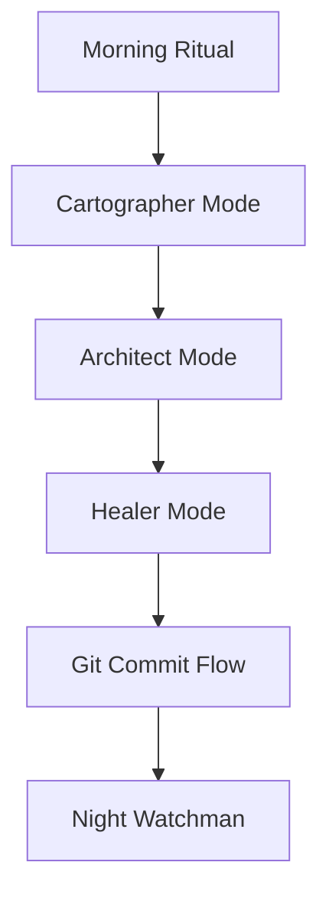

# 🤖 Smart Playwright Agent Framework
> **The Resilient Test Engine: AI-Native, Self-Healing, and Context-Aware.**

---

## 🚀 Why We Built This
Traditional test automation is often a "maintenance trap." Tests are fragile, selectors break with every UI change, and the context of *why* a test was written or *how* it should behave is often buried in old Jira tickets or outdated documentation.

We built this framework to shift from **Traditional QA** (fragile scripts) to **Smart Playwright Agent**:
- **Resilience over Rigidity:** Using AI to autonomously map and verify elements.
- **Living Documentation:** The "Agent Brain" (`.ai/`) stores context, memory, and decisions.
- **Self-Healing:** A dedicated mode for autonomous diagnosing and fixing of broken tests.

---

## 🧠 The Smart Playwright Agent Protocol
This framework is built around the **Smart Playwright Agent Protocol**, which treats the AI agent as a Senior QA Architect rather than just a script generator.

### 🏠 The Agent Brain (`.ai/`)
Everything the AI knows is stored here:
- **[1_CONTEXT/](.ai/1_CONTEXT/)**: Immutable truths, tech stack standards, and the [mission.md](.ai/1_CONTEXT/mission.md).
- **[2_PLANNING/](.ai/2_PLANNING/)**: Real-time coordination, [active_sprint.md](.ai/2_PLANNING/active_sprint.md), and UI maps.
- **[3_MEMORY/](.ai/3_MEMORY/)**: Historical data, the [selector_vault.md](.ai/3_MEMORY/selector_vault.md), and failure patterns.

---

## 🔄 The 6-Phase Daily Workflow
To maintain high hygiene and resilience, every session follows a strict cycle. The **Authoritative Guide** for this is [workflow.md](.ai/1_CONTEXT/workflow.md).



1.  **Morning Ritual** (Startup): Environment checks and context loading.
2.  **Cartographer Mode** (Discovery): AI maps the UI and populates the [Selector Vault](.ai/3_MEMORY/selector_vault.md).
3.  **Architect Mode** (Implementation): AI builds [Page Objects](pages/) and tests.
4.  **Healer Mode** (Fixes): AI autonomously fixes failures and logs lessons.
5.  **Git Commit Flow** (Documentation): Universal standards for high-hygiene commits.
6.  **Night Watchman Mode** (Shutdown): Metrics logging and rollover planning.

---

## 🛠️ How to Use This Framework

### 1. Setup
Ensure your MCP server is configured for your IDE (see [workflow.md](.ai/1_CONTEXT/workflow.md#mcp-configuration) for details).

```bash
npm install
npm install -y @executeautomation/playwright-mcp-server
```

### 2. Activate the Engine
Do not start by writing code. Start by activating the **Agentic Protocol**:

1.  **Prompt:** "Activate **Morning Ritual Mode**."
2.  Follow the AI's lead as it executes the 6-phase cycle.
3.  **Cartographer Mode Target:** Provide a URL, and watch the AI map the page.
4.  **Architect Mode:** Tell the AI what you want to test (e.g., "Automate the cart flow").

---

## 📜 Key Documentation Links
- **[Mission Statement](.ai/1_CONTEXT/mission.md)**: Core principles and role expectations.
- **[Tech Stack Reference](.ai/1_CONTEXT/tech_stack.md)**: Details on TypeScript, Playwright, and linting standards.
- **[Decision Log](.ai/1_CONTEXT/decision_log.md)**: Recorded architectural changes (ADRs).
- **[Full Workflow Guide](.ai/1_CONTEXT/workflow.md)**: The detailed manual for the 6-phase cycle of the Smart Playwright Agent.

---
**Status:** 🟢 Framework Ready | **Version:** 2.0.0
